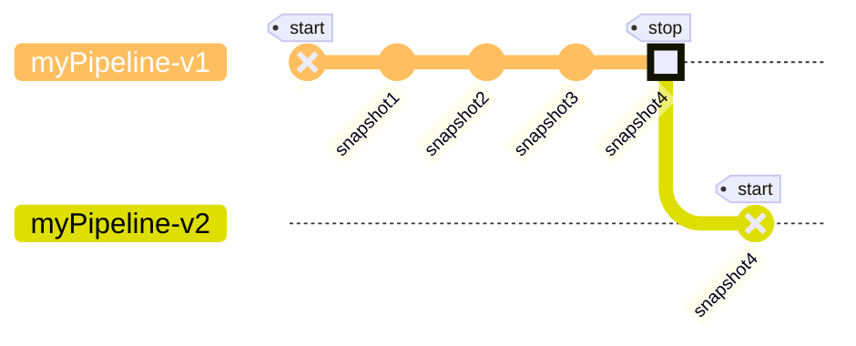

# Stream onchain data with Mirror

Mirror streams **onchain data directly to your database**, with \<1s latency.

Using a database offers unlimited queries and the flexibility to easily combine onchain and offchain data together in one place.

<Steps>
  <Step title="Choose a chain">
    <Card title="Mirror supports over 130+ chains." icon="arrow-right-from-line" href="/mirror/sources/supported-sources">
      You can [source](/mirror/sources/supported-sources) the data you want via
      a subgraph or direct indexing, then use
      [transforms](/mirror/transforms/transforms-overview) to further filter or
      map that data.
    </Card>
  </Step>

  <Step title="Choose a database">
    <Card title="Optimize your DB for what you do." icon="arrow-right-to-line" href="/mirror/sinks/supported-sinks">
      Mirror can minimize your latency if you're [running an
      app](/mirror/sinks/supported-sinks#for-apis-for-apps), or maximize your
      efficiency if you're [calculating
      analytics](/mirror/sinks/supported-sinks#for-analytics). You can even send
      data to a [channel](/mirror/extensions/channels/overview) to level up your
      data team.
    </Card>
  </Step>
</Steps>

Behind the scenes, Mirror automatically creates and runs data pipelines for you off a `.yaml` config file. Pipelines:

1. Are reorg-aware and update your datastores with the latest information
2. Fully manage backfills + edge streaming so you can focus on your product
3. Benefit from quality checks and automated fixes & improvements
4. Work with data across chains, harmonizing timestamps, etc. automatically

Set up your first database by [creating a pipeline](/mirror/create-a-pipeline) in 5 minutes.

Can't find what you're looking for? Reach out to us at [support@goldsky.com](mailto:support@goldsky.com) for help.


---

> To find navigation and other pages in this documentation, fetch the llms.txt file at: https://docs.goldsky.com/llms.txt

# Stream onchain data with Mirror

Mirror streams **onchain data directly to your database**, with \<1s latency.

Using a database offers unlimited queries and the flexibility to easily combine onchain and offchain data together in one place.

<Steps>
  <Step title="Choose a chain">
    <Card title="Mirror supports over 130+ chains." icon="arrow-right-from-line" href="/mirror/sources/supported-sources">
      You can [source](/mirror/sources/supported-sources) the data you want via
      a subgraph or direct indexing, then use
      [transforms](/mirror/transforms/transforms-overview) to further filter or
      map that data.
    </Card>
  </Step>

  <Step title="Choose a database">
    <Card title="Optimize your DB for what you do." icon="arrow-right-to-line" href="/mirror/sinks/supported-sinks">
      Mirror can minimize your latency if you're [running an
      app](/mirror/sinks/supported-sinks#for-apis-for-apps), or maximize your
      efficiency if you're [calculating
      analytics](/mirror/sinks/supported-sinks#for-analytics). You can even send
      data to a [channel](/mirror/extensions/channels/overview) to level up your
      data team.
    </Card>
  </Step>
</Steps>

Behind the scenes, Mirror automatically creates and runs data pipelines for you off a `.yaml` config file. Pipelines:

1. Are reorg-aware and update your datastores with the latest information
2. Fully manage backfills + edge streaming so you can focus on your product
3. Benefit from quality checks and automated fixes & improvements
4. Work with data across chains, harmonizing timestamps, etc. automatically

Set up your first database by [creating a pipeline](/mirror/create-a-pipeline) in 5 minutes.

Can't find what you're looking for? Reach out to us at [support@goldsky.com](mailto:support@goldsky.com) for help.


---

> To find navigation and other pages in this documentation, fetch the llms.txt file at: https://docs.goldsky.com/llms.txt

# About Mirror pipelines

<Note>
  We recently released v3 of pipeline configurations which uses a more intuitive
  and user friendly format to define and configure pipelines using a yaml file.
  For backward compatibility purposes, we will still support the previous v2
  format. This is why you will find references to each format in each yaml file
  presented across the documentation. Feel free to use whichever is more
  comfortable for you but we encourage you to start migrating to v3 format.
</Note>

## Overview

A Mirror Pipeline defines flow of data from `sources -> transforms  -> sinks`. It is configured in a `yaml` file which adheres to Goldsky's pipeline schema.

The core logic of the pipeline is defined in `sources`, `transforms` and `sinks` attributes.

* `sources` represent origin of the data into the pipeline.
* `transforms` represent data transformation/filter logic to be applied to either a source and/or transform in the pipeline.
* `sinks` represent destination for the source and/or transform data out of the pipeline.

Each `source` and `transform` has a unique name which is referenceable in other `transform` and/or `sink`, determining dataflow within the pipeline.

While the pipeline is configured in yaml, [goldsky pipeline CLI commands](/reference/cli#pipeline) are used to take actions on the pipeline such as: `start`, `stop`, `get`, `delete`, `monitor` etc.

Below is an example pipeline configuration which sources from `base.logs` Goldsky dataset, filters the data using `sql` and sinks to a `postgresql` table:

<Tabs>
  <Tab title="v3">
    ```yaml base-logs.yaml theme={null}
        apiVersion: 3
        name: base-logs-pipeline
        resource_size: s
        sources:
          base.logs:
            dataset_name: base.logs
            version: 1.0.0
            type: dataset
            description: Enriched logs for events emitted from contracts. Contains the contract address, data, topics, decoded event and metadata for blocks and transactions.
            display_name: Logs
        transforms:
          filter_logs_by_block_number:
            sql: SELECT * FROM base.logs WHERE block_number > 5000
            primary_key: id
        sinks:
          postgres_base_logs:
            type: postgres
            table: base_logs
            schema: public
            secret_name: GOLDSKY_SECRET
            description: "Postgres sink for: base.logs"
            from: filter_logs_by_block_number
    ```

    <Info>
      Keys in v3 format for sources, transforms and sinks are user provided
      values. In the above example, the source reference name `base.logs`
      matches the actual dataset name. This is the convention that you'll
      typically see across examples and autogenerated configurations. However,
      you can use a custom name as the key.
    </Info>
  </Tab>

  <Tab title="v2 (deprecated)">
    ```yaml base-logs.yaml theme={null}
        name: base-logs-pipeline
        resource_size: s
        apiVersion: 3
        definition:
         sources:
           - referenceName: base.logs
             type: dataset
             version: 1.0.0
         transforms: []
         sinks:
           - type: postgres
             table: base_logs
             schema: public
             secretName: GOLDSKY_SECRET
             description: 'Postgres sink for: base.logs'
             sourceStreamName: base.logs
             referenceName: postgres_base_logs
    ```
  </Tab>
</Tabs>

You can find the complete Pipeline configuration schema in the [reference](/reference/config-file/pipeline) page.

## Development workflow

Similar to the software development workflow of `edit -> compile -> run`, there's an implict iterative workflow of `configure -> apply -> monitor` for developing pipelines.

1. `configure`: Create/edit the configuration yaml file.
2. `apply`: Apply the configuration aka run the pipeline.
3. `monitor`: Monitor how the pipeline behaves. This will help create insights that'll generate ideas for the first step.

Eventually, you'll end up with a configuration that works for your use case.

Creating a Pipeline configuration from scratch is challenging. However, there are tools/guides/examples that make it easier to [get started](/mirror/create-a-pipeline).

## Understanding Pipeline Runtime Lifecycle

The `status` attribute represents the desired status of the pipeline and is provided by the user. Applicable values are:

* `ACTIVE` means the user wants to start the pipeline.
* `INACTIVE` means the user wants to stop the pipeline.
* `PAUSED` means the user wants to save-progress made by the pipeline so far and stop it.

A pipeline with status `ACTIVE` has a runtime status as well. Runtime represents the execution of the pipeline. Applicable runtime status values are:

* `STARTING` means the pipeline is being setup.
* `RUNNING` means the pipeline has been setup and is processing records.
* `FAILING` means the pipeline has encountered errors that prevents it from running successfully.
* `TERMINATED` means the pipeline has failed and the execution has been terminated.

There are several [goldsky pipeline CLI commands](/reference/config-file/pipeline#pipeline-runtime-commands) that help with pipeline execution.

For now, let's see how these states play out on successful and unsuccessful scenarios.

### Successful pipeline lifecycle

In this scenario the pipeline is succesfully setup and processing data without encountering any issues.
We consider the pipeline to be in a healthy state which translates into the following statuses:

* Desired `status` in the pipeline configuration is `ACTIVE`
* Runtime Status goes from `STARTING` to `RUNNING`

<div style={{display: 'flex', justifyContent: 'center'}}>
  ```mermaid  theme={null}
  stateDiagram-v2
      state ACTIVE {
        [*] --> STARTING
        STARTING --> RUNNING
      }
  ```
</div>

Let's look at a simple example below where we configure a pipeline that consumes Logs from Base chain and streams them into a Postgres database:

<Tabs>
  <Tab title="v3">
    ```yaml base-logs.yaml theme={null}
        name: base-logs-pipeline
        resource_size: s
        apiVersion: 3
        sources:
         base.logs:
           dataset_name: base.logs
           version: 1.0.0
           type: dataset
           description: Enriched logs for events emitted from contracts. Contains the contract address, data, topics, decoded event and metadata for blocks and transactions.
           display_name: Logs
        transforms: {}
        sinks:
         postgres_base_logs:
           type: postgres
           table: base_logs
           schema: public
           secret_name: GOLDSKY_SECRET
           description: "Postgres sink for: base.logs"
           from: base.logs
    ```
  </Tab>

  <Tab title="v2 (deprecated)">
    ```yaml base-logs.yaml theme={null}
        name: base-logs-pipeline
        definition:
         sources:
           - referenceName: base.logs
             type: dataset
             version: 1.0.0
         transforms: []
         sinks:
           - type: postgres
             table: base_logs
             schema: public
             secretName: GOLDSKY_SECRET
             description: 'Postgres sink for: base.logs'
             sourceStreamName: base.logs
             referenceName: postgres_base_logs
    ```
  </Tab>
</Tabs>

Let's attempt to run it using the command `goldsky pipeline apply base-logs.yaml --status ACTIVE` or `goldsky pipeline start base-logs.yaml`

```
❯ goldsky pipeline apply base-logs.yaml --status ACTIVE
│
◇  Successfully validated config file
│
◇  Successfully applied config to pipeline: base-logs-pipeline

To monitor the status of your pipeline:

Using the CLI: `goldsky pipeline monitor base-logs-pipeline`
Using the dashboard: https://app.goldsky.com/dashboard/pipelines/stream/base-logs-pipeline/1
```

At this point we have set the desired status to `ACTIVE`. We can confirm this using `goldsky pipeline list`:

```
❯ goldsky pipeline list
✔ Listing pipelines
────────────────────────────────────────
│ Name                          │ Version │ Status │ Resource │
│                               │         │        │ Size     │
│───────────────────────────────────────
│ base-logs-pipeline            │ 1       │ ACTIVE │ s        │
────────────────────────────────────────

```

We can then check the runtime status of this pipeline using the `goldsky pipeline monitor base-logs-pipeline` command:


We can see how the pipeline starts in `STARTING` status and becomes `RUNNING` as it starts processing data successfully into our Postgres sink.
This pipeline will start processing the historical data of the source dataset, reach its edge and continue streaming data in real time until we either stop it or it encounters error(s) that interrupts it's execution.

### Unsuccessful pipeline lifecycle

Let's now consider the scenario where the pipeline encounters errors during its lifetime and ends up failing.

There can be multitude of reasons for a pipeline to encounter errors such as:

* secrets not being correctly configured
* sink availability issues
* policy rules on the sink preventing the pipeline from writing records
* resource size incompatiblity
* and many more

These failure scenarios prevents a pipeline from getting-into or staying-in a `RUNNING` runtime status.

<div style={{display: 'flex', justifyContent: 'center'}}>
  ```mermaid  theme={null}
  ---
  title: Healthy pipeline becomes unhealthy
  ---
  stateDiagram-v2
      state status:ACTIVE {
        [*] --> STARTING
        STARTING --> RUNNING
        RUNNING --> FAILING
        FAILING --> TERMINATED
      }
  ```

  ```mermaid  theme={null}
  ---
  title: Pipeline cannot start
  ---
  stateDiagram-v2
      state status:ACTIVE {
        [*] --> STARTING
        STARTING --> FAILING
        FAILING --> TERMINATED
      }
  ```
</div>

A Pipeline can be in an `ACTIVE` desired status but a `TERMINATED` runtime status in scenarios that lead to terminal failure.

Let's see an example where we'll use the same configuration as above but set a `secret_name` that does not exist.

<Tabs>
  <Tab title="v3">
    ```yaml bad-base-logs.yaml theme={null}
        name: bad-base-logs-pipeline
        resource_size: s
        apiVersion: 3
        sources:
         base.logs:
           dataset_name: base.logs
           version: 1.0.0
           type: dataset
           description: Enriched logs for events emitted from contracts. Contains the contract address, data, topics, decoded event and metadata for blocks and transactions.
           display_name: Logs
        transforms: {}
        sinks:
         postgres_base_logs:
           type: postgres
           table: base_logs
           schema: public
           secret_name: YOUR_DATABASE_SECRET
           description: "Postgres sink for: base.logs"
           from: base.logs
    ```
  </Tab>

  <Tab title="v2 (deprecated)">
    ```yaml bad-base-logs.yaml theme={null}
        name: bad-base-logs-pipeline
        definition:
         sources:
           - referenceName: base.logs
             type: dataset
             version: 1.0.0
         transforms: []
         sinks:
           - type: postgres
             table: base_logs
             schema: public
             secretName: YOUR_DATABASE_SECRET
             description: 'Postgres sink for: base.logs'
             sourceStreamName: base.logs
             referenceName: postgres_base_logs
    ```
  </Tab>
</Tabs>

Let's start it using the command `goldsky pipeline apply bad-base-logs.yaml`.

```
❯ goldsky pipeline apply bad-base-logs.yaml
│
◇  Successfully validated config file
│
◇  Successfully applied config to pipeline: base-logs-pipeline

To monitor the status of your pipeline:

Using the CLI: `goldsky pipeline monitor bad-base-logs-pipeline`
Using the dashboard: https://app.goldsky.com/dashboard/pipelines/stream/bad-base-logs-pipeline/1
```

The pipeline configuration is valid, however, the pipeline runtime will encounter error since the secret that contains credentials to communicate with the sink does not exist.

Running `goldsky pipeline monitor bad-base-logs-pipeline` we see:


As expected, the pipeline has encountered a terminal error. Please note that the desired status is still `ACTIVE` even though the pipeline runtime status is `TERMINATED`

```
❯ goldsky pipeline list
✔ Listing pipelines
─────────────────────────────────────────
│ Name                          │ Version │ Status   │ Resource │
│                               │         │          │ Size     │
─────────────────────────────────────────
│ bad-base-logs-pipeline        │ 1       │ ACTIVE   │ s        │
─────────────────────────────────────────
```

## Runtime visibility

Pipeline runtime visibility is an important part of the pipeline development workflow. Mirror pipelines expose:

1. Runtime status and error messages
2. Logs emitted by the pipeline
3. Metrics on `Records received`, which counts all the records the pipeline has received from source(s) and, `Records written` which counts all records the pipeline has written to sink(s).
4. [Email notifications](/mirror/about-pipeline#email-notifications)

Runtime status, error messages and metrics can be seen via two methods:

1. Pipeline dashboard at `https://app.goldsky.com/dashboard/pipelines/stream/<pipeline_name>/<version>`
2. `goldsky pipeline monitor <name_or_path_to_config_file>` CLI command

Logs can only be seen in the pipeline dashboard.

Mirror attempts to surface appropriate and actionable error message and status for users, however, there is always room for imporovements. Please [reachout](/getting-support) if you think the experience can be improved.

### Email notifications

If a pipeline fails terminally the project members will get notified via an email.


You can configure this nofication in the [Notifications section](https://app.goldsky.com/dashboard/settings#notifications) of your project

## Error handling

There are two broad categories of errors.

**Pipeline configuration schema error**

This means the schema of the pipeline configuration is not valid. These errors are usually caught before pipeline execution. Some possible scenarios:

* a required attribute is missing
* transform SQL has syntax errors
* pipeline name is invalid

**Pipeline runtime error**

This means the pipeline encountered error during execution at runtime.

Some possible scenarios:

* credentails stored in the secret are incorrect or do not have needed access privilages
* sink availability issues
* poison-pill record that breaks the business logic in the transforms
* `resource_size` limitation

Transient errors are automatically retried as per retry-policy (for upto 6 hours) whearas non-transient ones immediately terminate the pipeline.

While many errors can be resolved by user intervention, there is a possibility of platform errors as well. Please [reachout to support](/getting-support) for investigation.

## Resource sizing

`resource_size` represents the compute (vCPUs and RAM) available to the pipeline. There are several options for pipeline sizes: `s, m, l, xl, xxl`. This attribute influences [pricing](/pricing/summary#mirror) as well.

Resource sizing depends on a few different factors such as:

* number of sources, transforms, sinks
* expected amount of data to be processed.
* transform sql involves joining multiple sources and/or transforms

Here's some general information that you can use as reference:

* A `small` resource size is usually enough in most use case: it can handle full backfill of small chain datasets and write to speeds of up to 300K records per second. For pipelines using
  subgraphs as source it can reliably handle up to 8 subgraphs.
* Larger resource sizes are usually needed when backfilling large chains or when doing large JOINS (example: JOIN between accounts and transactions datasets in Solana)
* It's recommended to always follow a defensive approach: start small and scale up if needed.

## Snapshots

A Pipeline snapshot captures a point-in-time state of a `RUNNING` pipeline allowing users to resume from it in the future.

It can be useful in various scenarios:

* evolving your `RUNNING` pipeline (eg: adding a new source, sink) without losing progress made so far.
* recover from new bug introductions where the user fix the bug and resume from an earlier snapshot to reprocess data.

Please note that snapshot only contains info about the progress made in reading the source(s) and the sql transform's state. It isn't representative of the state of the source/sink. For eg: if all data in the sink database table is deleted, resuming the pipeline from a snapshot does not recover it.

Currently, a pipeline can only be resumed from the latest available snapshot. If you need to resume from older snapshots, please [reachout to support](/getting-support)

Snapshots are closely tied to pipeline runtime in that all [commands](/reference/config-file/pipeline#pipeline-runtime-commands) that changes pipeline runtime has options to trigger a new snapshot and/or resume from the latest one.



### When are snapshots taken?

1. When updating a `RUNNING` pipeline, a snapshot is created before applying the update. This is to ensure that there's an up-to-date snapshot in case the update introduces issues.
2. When pausing a pipeline.
3. Automatically on regular intervals. For `RUNNING` pipelines in healthy state, automatic snapshots are taken every 4 hours to ensure minimal data loss in case of errors.
4. Users can request snapshot creation via the following CLI command:

* `goldsky pipeline snapshot create <name_or_path_to_config>`
* `goldsky pipeline apply <name_or_path_to_config> --from-snapshot new`
* `goldsky pipeline apply <name_or_path_to_config> --save-progress true` (CLI version \< `11.0.0`)

5. Users can list all snapshots in a pipeline via the following CLI command:

* `goldsky pipeline snapshot list <name_or_path_to_config>`

### How long does it take to create a snapshot

The amount of time it takes for a snapshot to be created depends largly on two factors. First, the amount of state accumulated during pipeline execution. Second, how fast records are being processed end-end in the pipeline.

In case of a long running snapshot that was triggered as part of an update to the pipeline, any future updates are blocked until snapshot is completed. Users do have an option to cancel the update request.

There is a scenario where the the pipeline was healthy at the time of starting the snapshot however, became unhealthy later preventing snapshot creation. Here, the pipeline will attempt to recover however, may need user intervention that involves restarting from last successful snapshot.

### Scenarios and Snapshot Behavior

Happy Scenario:

* Suppose a pipeline is at 50% progress, and an automatic snapshot is taken.
* The pipeline then progresses to 60% and is in a healthy state. If you pause the pipeline at this point, a new snapshot is taken.
* You can later start the pipeline from the 60% snapshot, ensuring continuity from the last known healthy state.

Bad Scenario:

* If the pipeline reaches 50%, and an automatic snapshot is taken.
* It then progresses to 60% but enters a bad state. Attempting to pause the pipeline in this state will fail.
* If you restart the pipeline, it will resume from the last successful snapshot at 50%, there was no snapshot created at 60%

Can't find what you're looking for? Reach out to us at [support@goldsky.com](mailto:support@goldsky.com) for help.


---

> To find navigation and other pages in this documentation, fetch the llms.txt file at: https://docs.goldsky.com/llms.txt

# Subgraphs

You can use subgraphs as a pipeline source, allowing you to combined the flexibility of subgraph indexing with the expressiveness of the database of your choice.

This enables a lot of powerful use-cases:

* Reuse all your existing subgraph entities.
* Increase querying speeds drastically compared to graphql-engines.
* Flexible aggregations that weren't possible with just GraphQL.
* Analytics on protocols through Clickhouse, and more.
* Plug into BI tools, train AI, and export data for your users

Full configuration details for Subgraph Entity source is available in the [reference](/reference/config-file/pipeline#subgraph-entity) page.

## Automatic Deduplication

Subgraphs natively support time travel queries. This means every historical version of every entity is stored. To do this, each row has an `id`, `vid`, and `block_range`.

When you update an entity in a subgraph mapping handler, a new row in the database is created with the same ID, but new VID and block\_range, and the old row's `block_range` is updated to have an end.

By default, pipelines **deduplicate** on `id`, to show only the latest row per `id`. In other words, historical entity state is not kept in the sink database. This saves a lot of database space and makes for easier querying, as additional deduplication logic is not needed for simple queries. In a postgres database for example, the pipeline will update existing rows with the values from the newest block.

This deduplication happens through setting the primary key in the data going through the pipeline. By default, the primary key is `id`.

If historical data is desired, you can set the primary key to `vid` through a transform.

<Tabs>
  <Tab title="v3">
    ```yaml  theme={null}
    name: qidao-optimism-subgraph-to-postgrse
    apiVersion: 3
    sources:
      subgraph_account:
          type: subgraph_entity
          name: account
          subgraphs:
          - name: qidao-optimism
            version: 1.1.0
    transforms:
      historical_accounts:
        sql: >-
          select * from subgraph_account
        primary_key: vid
    sinks:
      postgres_account:
        type: postgres
        table: historical_accounts
        schema: goldsky
        secret_name: A_POSTGRESQL_SECRET
        from: historical_accounts
    ```
  </Tab>

  <Tab title="v2 (deprecated)">
    ```yaml  theme={null}
    sources:
      - type: subgraphEntity
        # The deployment IDs you gathered above. If you put multiple,
        # they must have the same schema
        deployments:
          - id: QmPuXT3poo1T4rS6agZfT51ZZkiN3zQr6n5F2o1v9dRnnr
        # A name, referred to later in the `sourceStreamName` of a transformation or sink
        referenceName: account
        entity:
          # The name of the entities
          name: account

    transforms:
      - referenceName: historical_accounts
        type: sql
        # The `account` referenced here is the referenceName set in the source
        sql: >-
          select * from account
        primaryKey: vid


    sinks:
      - type: postgres
        table: historical_accounts
        schema: goldsky
        secretName: A_POSTGRESQL_SECRET
        # the `historical_accounts` is the referenceKey of the transformation made above
        sourceStreamName: historical_accounts
    ```
  </Tab>
</Tabs>

In this case, all historical versions of the entity will be retained in the pipeline sink. If there was no table, tables will be automatically created as well.

## Using the wizard

### Subgraphs from your project

Use any of your own subgraphs as a pipeline source. Use `goldsky pipeline create <pipeline-name>` and select `Project Subgraph`, and push subgraph data into any of our supported sinks.

### Community subgraphs

When you create a new pipeline with `goldsky pipeline create <your-pipeline-name>`, select **Community Subgraphs** as the source type. This will display a list of available subgraphs to choose from. Select the one you are interested in and follow the prompts to complete the pipeline creation.

This will get load the subgraph into your project and create a pipeline with that subgraph as the source.


---

> To find navigation and other pages in this documentation, fetch the llms.txt file at: https://docs.goldsky.com/llms.txt

# Direct indexing

With mirror pipelines, you can access to indexed on-chain data. Define them as a source and pipe them into any sink we support.

## Use-cases

* Mirror specific logs and traces from a set of contracts into a postgres database to build an API for your protocol
* ETL data into a data warehouse to run analytics
* Push the full blockchain into Kafka or S3 to build a datalake for ML

## Supported Chains

### EVM chains

For EVM chains we support the following 4 datasets:

| Dataset               | Description                                                                                                                        |
| --------------------- | ---------------------------------------------------------------------------------------------------------------------------------- |
| Blocks                | Metadata for each block on the chain including hashes, transaction count, difficulty, and gas used.                                |
| Logs                  | Raw logs for events emitted from contracts. Contains the contract address, data, topics, and metadata for blocks and transactions. |
| Enriched Transactions | Transaction data including input, value, from and to address, and metadata for the block, gas, and receipts.                       |
| Traces                | Traces of all function calls made on the chain including metadata for block, trace, transaction, and gas.                          |

### Fast Scan

Some datasets have support for [Fast Scan](/mirror/sources/direct-indexing#backfill-vs-fast-scan) which allows you to more quickly backfill filtered data. If a chain has partial support for Fast Scan, the dataset that doesn't support fast scan will have an asterisk `*` next to it.

Here's a breakdown of the EVM chains we support and their corresponding datasets:

|                      | Blocks | Enriched Transactions | Logs | Traces | Fast Scan |
| -------------------- | ------ | --------------------- | ---- | ------ | --------- |
| 0G                   | ✓      | ✓                     | ✓    | ✗      | ✗         |
| 0G Galileo Testnet   | ✓      | ✓                     | ✓    | ✗      | ✗         |
| Abstract             | ✓      | ✓                     | ✓    | ✗      | ✗         |
| Align Testnet        | ✓      | ✓                     | ✓    | ✓      | ✓         |
| Apechain             | ✓      | ✓                     | ✓    | ✗      | ✗         |
| Apechain Curtis      | ✓      | ✓                     | ✓    | ✓\*    | ✓         |
| Proof of Play Apex   | ✓      | ✓                     | ✓    | ✗      | ✓         |
| Arbitrum Nova        | ✓      | ✓                     | ✓    | ✗      | ✓         |
| Arbitrum One         | ✓      | ✓                     | ✓    | ✓\*    | ✓         |
| Arbitrum Sepolia     | ✓      | ✓                     | ✓    | ✗      | ✓         |
| Arena-Z              | ✓      | ✓                     | ✓    | ✓      | ✗         |
| Arena-Z Testnet      | ✓      | ✓                     | ✓    | ✓      | ✗         |
| Arweave \*           | ✓      | ✓                     | N/A  | N/A    | ✗         |
| Automata             | ✓      | ✓                     | ✓    | ✓      | ✗         |
| Automata Testnet     | ✓      | ✓                     | ✓    | ✗      | ✗         |
| Avalanche            | ✓      | ✓                     | ✓    | ✓      | ✓         |
| B3                   | ✓      | ✓                     | ✓    | ✓      | ✗         |
| B3 Sepolia           | ✓      | ✓                     | ✓    | ✓      | ✗         |
| Base                 | ✓      | ✓                     | ✓    | ✓      | ✓         |
| Base Sepolia         | ✓      | ✓                     | ✓    | ✓      | ✓         |
| Berachain Bepolia    | ✓      | ✓                     | ✓    | ✓      | ✗         |
| Berachain Mainnet    | ✓      | ✓                     | ✓    | ✓      | ✗         |
| Bitcoin              | ✓      | ✓                     | ✗    | ✗      | ✗         |
| Blast                | ✓      | ✓                     | ✓    | ✓      | ✓         |
| Build on Bitcoin     | ✓      | ✓                     | ✓    | ✓      | ✓         |
| Binance Smart Chain  | ✓      | ✓                     | ✓    | ✓      | ✓         |
| Camp Testnet         | ✓      | ✓                     | ✓    | ✓      | ✓         |
| Celo                 | ✓\*    | ✓\*                   | ✓    | ✓      | ✓         |
| Celo Dango Testnet   | ✓      | ✓                     | ✓    | ✓      | ✗         |
| Codex                | ✓      | ✓                     | ✓    | ✓      | ✗         |
| Corn Maizenet        | ✓      | ✓                     | ✓    | ✓      | ✗         |
| Cronos zkEVM         | ✓      | ✓                     | ✓    | ✗      | ✗         |
| Cronos zkEVM Sepolia | ✓      | ✓                     | ✓    | ✗      | ✗         |
| Cyber                | ✓      | ✓                     | ✓    | ✓      | ✓         |
| Cyber Testnet        | ✓      | ✓                     | ✓    | ✓      | ✗         |
| Degen                | ✓      | ✓                     | ✓    | ✓      | ✗         |
| Ethena Testnet       | ✓      | ✓                     | ✓    | ✗      | ✗         |
| Ethereum             | ✓      | ✓                     | ✓    | ✓      | ✓         |
| Ethereum Holesky     | ✓      | ✓                     | ✓    | ✓      | ✓         |
| Ethereum Sepolia     | ✓      | ✓                     | ✓    | ✓      | ✓         |
| Etherlink            | ✓      | ✓                     | ✓    | ✓      | ✗         |
| Etherlink Shadownet  | ✓      | ✗                     | ✗    | ✗      | ✗         |
| Ethernity            | ✓      | ✓                     | ✓    | ✓      | ✗         |
| Ethernity Testnet    | ✓      | ✓                     | ✓    | ✓      | ✗         |
| Fantom               | ✓      | ✓                     | ✓    | ✓      | ✓         |
| Flare                | ✓      | ✓                     | ✓    | ✗      | ✗         |
| Flare Testnet        | ✓      | ✓                     | ✓    | ✗      | ✗         |
| Fluent Devnet        | ✓      | ✓                     | ✓    | ✓      | ✗         |
| Forma                | ✓      | ✓                     | ✓    | ✓      | ✓         |
| Frax                 | ✓      | ✓                     | ✓    | ✓      | ✓         |
| Gensyn Testnet       | ✓      | ✓                     | ✓    | ✗      | ✗         |
| Gnosis               | ✓      | ✓                     | ✓    | ✓      | ✗         |
| Gravity              | ✓      | ✓                     | ✓    | ✓      | ✗         |
| Ham                  | ✓      | ✓                     | ✓    | ✓      | ✗         |
| HashKey              | ✓      | ✓                     | ✓    | ✗      | ✗         |
| HyperEVM             | ✓      | ✓                     | ✓    | ✗      | ✗         |
| Immutable Testnet    | ✓      | ✓                     | ✓    | ✗      | ✗         |
| Immutable zkEVM      | ✓      | ✓                     | ✓    | ✗      | ✗         |
| Ink                  | ✓      | ✓                     | ✓    | ✓      | ✗         |
| Ink Sepolia          | ✓      | ✓                     | ✓    | ✓      | ✗         |
| IOTA EVM             | ✓      | ✓                     | ✓    | ✓      | ✗         |
| Kroma                | ✓      | ✓                     | ✓    | ✓      | ✗         |
| Linea                | ✓      | ✓                     | ✓    | ✓      | ✗         |
| Lisk                 | ✓      | ✓                     | ✓    | ✓      | ✗         |
| Lisk Sepolia         | ✓      | ✓                     | ✓    | ✓      | ✗         |
| Lith Testnet         | ✓      | ✓                     | ✓    | ✓      | ✓         |
| Lyra                 | ✓      | ✓                     | ✓    | ✓      | ✗         |
| Lyra Testnet         | ✓      | ✓                     | ✓    | ✓      | ✗         |
| MegaETH              | ✓      | ✓                     | ✓    | ✓      | ✗         |
| MegaETH Testnet      | ✓      | ✓                     | ✓    | ✗      | ✗         |
| Metal                | ✓      | ✓                     | ✓    | ✓      | ✗         |
| Metal Testnet        | ✓      | ✓                     | ✓    | ✓      | ✗         |
| Mezo                 | ✓      | ✓                     | ✓    | ✓      | ✗         |
| Mezo Testnet         | ✓      | ✓                     | ✓    | ✗      | ✗         |
| Midnight Devnet      | ✓      | ✓                     | ✓    | ✗      | ✗         |
| Mint                 | ✓      | ✓                     | ✓    | ✓      | ✓         |
| Mint Sepolia         | ✓      | ✓                     | ✓    | ✓      | ✗         |
| Mode                 | ✓      | ✓                     | ✓    | ✓      | ✓         |
| Mode Testnet         | ✓      | ✓                     | ✓    | ✓      | ✓         |
| Monad                | ✓      | ✓                     | ✓    | ✓      | ✗         |
| Monad Testnet        | ✓      | ✓                     | ✓    | ✓      | ✗         |
| Morph                | ✓      | ✓                     | ✓    | ✗      | ✗         |
| Neura Testnet        | ✓      | ✓                     | ✓    | ✗      | ✗         |
| Oasys Homeverse      | ✓      | ✓                     | ✓    | ✓\*    | ✓         |
| Optimism             | ✓      | ✓                     | ✓    | ✓      | ✓         |
| Optimism Sepolia     | ✓      | ✓                     | ✓    | ✓      | ✓         |
| Orderly              | ✓      | ✓                     | ✓    | ✓      | ✗         |
| Orderly Sepolia      | ✓      | ✓                     | ✓    | ✓      | ✗         |
| Palm                 | ✓      | ✓                     | ✓    | ✓      | ✓         |
| Palm Testnet         | ✓      | ✓                     | ✓    | ✓      | ✗         |
| Plasma               | ✓      | ✓                     | ✓    | ✓      | ✗         |
| Plasma Testnet       | ✓      | ✓                     | ✓    | ✓      | ✗         |
| Plume                | ✓      | ✓                     | ✓    | ✗      | ✗         |
| Pharos Devnet        | ✓      | ✓                     | ✓    | ✗      | ✗         |
| Pharos Testnet       | ✓      | ✓                     | ✓    | ✓      | ✗         |
| Polygon              | ✓      | ✓                     | ✓    | ✓      | ✗         |
| Polynomial           | ✓      | ✓                     | ✓    | ✓      | ✗         |
| Proof of Play Barret | ✓      | ✓                     | ✓    | ✓      | ✗         |
| Proof of Play Boss   | ✓      | ✓                     | ✓    | ✓      | ✗         |
| Proof of Play Cloud  | ✓      | ✓                     | ✓    | ✓      | ✗         |
| Public Good Network  | ✓      | ✓                     | ✓    | ✓      | ✓         |
| Race                 | ✓      | ✓                     | ✓    | ✓      | ✗         |
| Rari                 | ✓      | ✓                     | ✓    | ✓      | ✓         |
| Redstone             | ✓      | ✓                     | ✓    | ✓      | ✓         |
| Reya                 | ✓      | ✓                     | ✓    | ✗      | ✓         |
| Rise Sepolia         | ✓      | ✓                     | ✓    | ✓      | ✗         |
| Ruby Testnet         | ✓      | ✓                     | ✓    | ✗      | ✓         |
| Scroll               | ✓      | ✓                     | ✓    | ✓      | ✓         |
| Scroll Sepolia       | ✓      | ✓                     | ✓    | ✓      | ✗         |
| Sei                  | ✓      | ✓                     | ✓    | ✓      | ✗         |
| Settlus              | ✓      | ✓                     | ✓    | ✓      | ✗         |
| Shape                | ✓      | ✓                     | ✓    | ✓      | ✓         |
| Shape Sepolia        | ✓      | ✓                     | ✓    | ✓      | ✗         |
| Shrapnel             | ✓      | ✓                     | ✓    | ✗      | ✓         |
| SNAXchain            | ✓      | ✓                     | ✓    | ✓      | ✗         |
| Soneium              | ✓      | ✓                     | ✓    | ✗      | ✗         |
| Soneium Minato       | ✓      | ✓                     | ✓    | ✗      | ✗         |
| Sonic                | ✓      | ✓                     | ✓    | ✗      | ✗         |
| Sophon               | ✓      | ✓                     | ✓    | ✓      | ✗         |
| Sophon Testnet       | ✓      | ✓                     | ✓    | ✗      | ✗         |
| Story                | ✓      | ✓                     | ✓    | ✓      | ✗         |
| Story Aeneid Testnet | ✓      | ✓                     | ✓    | ✓      | ✗         |
| Superseed            | ✓      | ✓                     | ✓    | ✓      | ✗         |
| Superseed Sepolia    | ✓      | ✓                     | ✓    | ✓      | ✓         |
| Swan                 | ✓      | ✓                     | ✓    | ✓      | ✗         |
| Swellchain           | ✓      | ✓                     | ✓    | ✗      | ✗         |
| Swellchain Testnet   | ✓      | ✓                     | ✓    | ✗      | ✗         |
| TAC                  | ✓      | ✓                     | ✓    | ✗      | ✗         |
| TAC Turin Testnet    | ✓      | ✓                     | ✓    | ✗      | ✗         |
| Taiko Hoodi Testnet  | ✓      | ✓                     | ✓    | ✗      | ✗         |
| Tempo Andantino      | ✓      | ✓                     | ✓    | ✗      | ✗         |
| TRON                 | ✓      | ✓                     | ✓    | ✗      | ✗         |
| Unichain             | ✓      | ✓                     | ✓    | ✓      | ✗         |
| Unichain Sepolia     | ✓      | ✓                     | ✓    | ✗      | ✗         |
| Viction              | ✓      | ✓                     | ✓    | ✗      | ✗         |
| World Chain          | ✓      | ✓                     | ✓    | ✗      | ✗         |
| XPLA                 | ✓      | ✓                     | ✓    | ✗      | ✗         |
| XR Sepolia           | ✓      | ✓                     | ✓    | ✗      | ✗         |
| Xterio               | ✓      | ✓                     | ✓    | ✓      | ✗         |
| Zero                 | ✓      | ✓                     | ✓    | ✓      | ✗         |
| Zero Sepolia         | ✓      | ✓                     | ✓    | ✗      | ✗         |
| Zetachain            | ✓      | ✓                     | ✓    | ✓      | ✓         |
| zkSync Era           | ✓      | ✓                     | ✓    | ✓      | ✓         |
| Zora                 | ✓      | ✓                     | ✓    | ✓      | ✓         |
| Zora Sepolia         | ✓      | ✓                     | ✓    | ✓      | ✗         |

\* The Arweave dataset includes bundled/L2 data.

### Non-EVM chains

#### Beacon

| Dataset                                    | Description                                                                         |
| ------------------------------------------ | ----------------------------------------------------------------------------------- |
| Attestations                               | Attestations (votes) from validators for the block.                                 |
| Attester Slashing                          | Metadata for attester slashing.                                                     |
| Blocks                                     | Metadata for each block on the chain including hashes, deposit count, and gas used. |
| BLS Signature to Execution Address Changes | BLS Signature to Execution Address Changes.                                         |
| Deposits                                   | Metadata for deposits.                                                              |
| Proposer Slashing                          | Metadata for proposer slashing.                                                     |
| Voluntary Exits                            | Metadata for voluntary exits.                                                       |
| Withdrawls                                 | Metadata for withdrawls.                                                            |

#### Fogo

| Dataset                        | Description                                                                                              |
| ------------------------------ | -------------------------------------------------------------------------------------------------------- |
| Transactions with Instructions | Enriched transaction data including instructions, accounts, balance changes, and metadata for the block. |
| Rewards                        | Records of rewards distributed to validators for securing and validating the network.                    |
| Blocks                         | Metadata for each block on the chain including hashes, transaction count, slot and leader rewards.       |

#### IOTA

| Dataset      | Description                                                                                                                                                                                                  |
| ------------ | ------------------------------------------------------------------------------------------------------------------------------------------------------------------------------------------------------------ |
| Checkpoints  | A checkpoint is a periodic, finalized snapshot of the blockchain's state in the Movement VM, batching transactions to ensure consistency and scalability across the network.                                 |
| Epochs       | An epoch is a defined time period in the Movement VM during which a fixed set of validators processes transactions and manages governance, with transitions enabling validator rotation and network updates. |
| Events       | Events in the Movement VM are structured data emissions from smart contracts, recorded on the blockchain to log significant actions or state changes for external monitoring and interaction.                |
| Move Calls   | Move calls are a function invocation within a Move smart contract, executed by the Movement VM to perform specific operations or state transitions on the blockchain.                                        |
| Transactions | A transaction in the Movement VM is a signed instruction executed by the Move smart contract to modify the blockchain's state, such as transferring assets or invoking contract functions.                   |

#### Movement

| Dataset                     | Description                                                                                                |
| --------------------------- | ---------------------------------------------------------------------------------------------------------- |
| Account Transactions        | All raw onchain transactions involving account-level actions (e.g., transaction version, account address). |
| Block Metadata Transactions | Metadata about blocks and block-level transactions (e.g., block height, epoch, version).                   |
| Fungible Asset Balances     | Real-time balances of fungible tokens across accounts.                                                     |
| Current Token Data          | Latest metadata for tokens - includes name, description, supply, etc.                                      |
| Current Token Ownerships    | Snapshot of token ownership across the chain.                                                              |
| Events                      | All emitted contract event logs - useful for indexing arbitrary contract behavior.                         |
| Fungible Asset Activities   | Track activity for fungible tokens - owner address, amount, and type.                                      |
| Fungible Asset Balances     | Historical balance tracking for fungible assets (not just the current state).                              |
| Fungible Asset Metadata     | Static metadata for fungible tokens - like decimals, symbol, and name.                                     |
| Signatures                  | Cryptographic signature data from transactions, useful for validating sender authenticity.                 |
| Token Activities            | Detailed logs of token movements and interactions across tokens and NFTs.                                  |

#### Solana

| Dataset                             | Description                                                                                                                                                      |
| ----------------------------------- | ---------------------------------------------------------------------------------------------------------------------------------------------------------------- |
| Edge Accounts                       | Contains details of all active accounts on the Solana blockchain, including balance and owner information. Live data from slot 271611201.                        |
| Edge Blocks                         | Metadata for each block on the chain including hashes, transaction count, difficulty, and gas used. Live data from slot 271611201.                               |
| Edge Instructions                   | Specific operations within transactions that describe the actions to be performed on the Solana blockchain. Live data from slot 271611201.                       |
| Edge Rewards                        | Records of rewards distributed to validators for securing and validating the Solana network. Live data from slot 271611201.                                      |
| Edge Token Transfers                | Transactions involving the movement of tokens between accounts on the Solana blockchain. Live data from slot 271611201.                                          |
| Edge Tokens                         | Information about different token types issued on the Solana blockchain, including metadata and supply details. Live data from slot 271611201.                   |
| Edge Transactions                   | Enriched transaction data including input, value, from and to address, and metadata for the block, gas and receipt. Live data from slot 271611201.               |
| Edge Transactions with Instructions | Enriched transaction data including instructions, input, value, from and to address, and metadata for the block, gas and receipt. Live data from slot 316536533. |

<Note>
  You can interact with these Solana datasets at no cost at
  [https://crypto.clickhouse.com/](https://crypto.clickhouse.com/)
</Note>

#### Starknet

| Dataset      | Description                                                                                                  |
| ------------ | ------------------------------------------------------------------------------------------------------------ |
| Blocks       | Metadata for each block on the chain including hashes, transaction count, difficulty, and gas used.          |
| Events       | Consists of raw event data from the blockchain, documenting various on-chain activities and triggers.        |
| Messages     | Messaging data from the Starknet blockchain, used for L2 & L1 communication.                                 |
| Transactions | Transaction data including input, value, from and to address, and metadata for the block, gas, and receipts. |

#### Stellar

| Dataset         | Description                                                                                                                                                         |
| --------------- | ------------------------------------------------------------------------------------------------------------------------------------------------------------------- |
| Assets          | Contains information about all assets issued on the Stellar network, including details like asset codes, issuers, and related metadata.                             |
| Contract Events | Records events related to smart contract execution on the Stellar network, detailing the interactions and state changes within contracts.                           |
| Effects         | Captures the effects of various operations on the Stellar ledger, such as changes in balances, creation of accounts, and other state modifications.                 |
| Ledgers         | Provides a comprehensive record of all ledger entries, summarizing the state of the blockchain at each ledger close, including transaction sets and ledger headers. |

#### Sui

| Dataset      | Description                                                                                                                           |
| ------------ | ------------------------------------------------------------------------------------------------------------------------------------- |
| Checkpoints  | Contains raw data of blockchain checkpoints capturing the state of the ledger at specific intervals.                                  |
| Epochs       | Includes raw data detailing the various epochs in the blockchain, which mark significant periods or phases in the network's operation |
| Events       | Consists of raw event data from the blockchain, documenting various on-chain activities and triggers                                  |
| Packages     | Contains raw data about the deployed smart contract packages on the blockchain                                                        |
| Transactions | Transaction data including effects, events, senders, recipients, balance and object changes, and other metadata.                      |

### Curated Datasets

Beyond onchain datasets, the Goldsky team continuosly curates and publishes derived datasets that serve a specific audience or use case. Here's the list:

#### Token Transfers

You can expect every EVM chain to have the following datasets available:

| Dataset   | Description                                       |
| --------- | ------------------------------------------------- |
| ERC\_20   | Every transfer event for all fungible tokens.     |
| ERC\_721  | Every transfer event for all non-fungible tokens. |
| ERC\_1155 | Every transfer event for all ERC-1155 tokens.     |

#### Polymarket datasets

| Dataset              | Description                                                                                                                                                                                                                                                                                                                                        |
| -------------------- | -------------------------------------------------------------------------------------------------------------------------------------------------------------------------------------------------------------------------------------------------------------------------------------------------------------------------------------------------- |
| Global Open Interest | Keeps track of global open interest.                                                                                                                                                                                                                                                                                                               |
| Market Open Interest | Keeps track of open interest for each market.                                                                                                                                                                                                                                                                                                      |
| Order Filled         | This event is emitted when a single Polymarket order is partially or completely filled. For example: a 50c YES buy for 100 YES matched against a 50c YES sell for 100 YES will emit 2 Orderi Filled events, from the perspective of the YES buy and of the YES sell. This is useful for granular tracking of trading activity and history.         |
| Orders Matched       | This event is emitted when a Polymarket taker order is matched against a set of Polymarket maker(limit) orders. For example: a 50c YES buy for 200 YES matched against 2 50c YES sells for 100 YES each will emit a single Orders Matched event. Orders Matched gives a more high level view of trading activity as it only tracks taker activity. |
| User Balances        | This event keeps track of all user outcome token positions.                                                                                                                                                                                                                                                                                        |
| User Positions       | Keeps track of outcome token positions along with pnl specific data including average price and realized pnl.                                                                                                                                                                                                                                      |

Additional chains, including roll-ups, can be indexed on demand. Contact us at [sales@goldsky.com](mailto:sales@goldsky.com) to learn more.

## Schema

The schema for each of these datasets can be found [here](/reference/schema/EVM-schemas).

## Backfill vs Fast Scan

Goldsky allows you either backfill the entire datasets or alternatively pre-filter the data based on specific attributes.
This allows for an optimal cost and time efficient streaming experience based on your specific use case.

For more information on how to enable each streaming mode in your pipelines visit our [reference documentation](/reference/config-file/pipeline#backfill-vs-fast-scan).


---

> To find navigation and other pages in this documentation, fetch the llms.txt file at: https://docs.goldsky.com/llms.txt

# Overview

> Learn about Mirror's powerful transformation capabilities.

While the simple pipelines let you get real-time data from one of our data sets into your own destination, most teams also do enrichment and filtering using transforms.

With transforms, you can decode check external API is call contracts storage and more. You can even call your own APIs in order to tie the pipeline into your existing system seamlessly.

## [SQL Transforms](/mirror/transforms/sql-transforms)

SQL transforms allow you to write SQL queries to modify and shape data from multiple sources within the pipeline. This is ideal for operations that need to be performed within the data pipeline itself, such as filtering, aggregating, or joining datasets.

Depending on how you choose to [source](/mirror/sources/supported-sources) your data, you might find that you run into 1 of 2 challenges:

1. **You only care about a few contracts**

   Rather than fill up your database with a ton of extra data, you'd rather ***filter*** down your data to a smaller set.
2. **The data is still a bit raw**

   Maybe you'd rather track gwei rounded to the nearest whole number instead of wei.  You're looking to ***map*** data to a different format so you don't have to run this calculation over and over again.

## [External Handler Transforms](/mirror/transforms/external-handlers)

With external handler transforms, you can send data from your Mirror pipeline to an external service via HTTP and return the processed results back into the pipeline. This opens up a world of possibilities by allowing you to bring your own custom logic, programming languages, and external services into the transformation process.

Key Features of External Handler Transforms:

* Send data to external services via HTTP.
* Supports a wide variety of programming languages and external libraries.
* Handle complex processing outside the pipeline and return results in real time.
* Guaranteed at least once delivery and back-pressure control to ensure data integrity.

### How External Handlers work

1. The pipeline sends a POST request to the external handler with a mini-batch of JSON rows.
2. The external handler processes the data and returns the transformed rows in the same format and order as received


---

> To find navigation and other pages in this documentation, fetch the llms.txt file at: https://docs.goldsky.com/llms.txt

# SQL Transforms

> Transforming blockchain data with Streaming SQL

## SQL Transforms

SQL transforms allow you to write SQL queries to modify and shape data from multiple sources within the pipeline. This is ideal for operations that need to be performed within the data pipeline itself, such as filtering, aggregating, or joining datasets.

Depending on how you choose to [source](/mirror/sources/supported-sources) your data, you might find that you run into 1 of 2 challenges:

1. **You only care about a few contracts**

   Rather than fill up your database with a ton of extra data, you'd rather ***filter*** down your data to a smaller set.
2. **The data is still a bit raw**

   Maybe you'd rather track gwei rounded to the nearest whole number instead of wei.  You're looking to ***map*** data to a different format so you don't have to run this calculation over and over again.

### The SQL Solution

You can use SQL-based transforms to solve both of these challenges that normally would have you writing your own indexer or data pipeline. Instead, Goldsky can automatically run these for you using just 3 pieces of info:

* `name`: **A shortname for this transform**

  You can refer to this from sinks via `from` or treat it as a table in SQL from other transforms.
* `sql`: **The actual SQL**

  To filter your data, use a `WHERE` clause, e.g. `WHERE liquidity > 1000`.

  To map your data, use an `AS` clause combined with `SELECT`, e.g. `SELECT wei / 1000000000 AS gwei`.
* `primary_key`: **A unique ID**

  This should be unique, but you can also use this to intentionally de-duplicate data - the latest row with the same ID will replace all the others.

Combine them together into your [config](/reference/config-file/pipeline):

<Tabs>
  <Tab title="v3">
    ```yaml  theme={null}
    transforms:
      negative_fpmm_scaled_liquidity_parameter:
        sql: SELECT id FROM polymarket.fixed_product_market_maker WHERE scaled_liquidity_parameter < 0
        primary_key: id
    ```
  </Tab>

  <Tab title="v2 (deprecated)">
    ```yaml  theme={null}
    transforms:
      - referenceName: negative_fpmm_scaled_liquidity_parameter
        type: sql
        sql: SELECT id FROM polygon.fixed_product_market_maker WHERE scaled_liquidity_parameter < 0
        primaryKey: id
    ```
  </Tab>
</Tabs>

That's it. You can now filter and map data to exactly what you need.


---

> To find navigation and other pages in this documentation, fetch the llms.txt file at: https://docs.goldsky.com/llms.txt

# External Handler Transforms

> Transforming data with an external http service.

With external handler transforms, you can send data from your Mirror pipeline to an external service via HTTP and return the processed results back into the pipeline. This opens up a world of possibilities by allowing you to bring your own custom logic, programming languages, and external services into the transformation process.

[In this repo](https://github.com/goldsky-io/documentation-examples/tree/main/mirror-pipelines/goldsky-enriched-erc20-pipeline) you can see an example implementation of enriching ERC-20 Transfer Events with an HTTP service.

**Key Features of External Handler Transforms:**

* Send data to external services via HTTP.
* Supports a wide variety of programming languages and external libraries.
* Handle complex processing outside the pipeline and return results in real time.
* Guaranteed at least once delivery and back-pressure control to ensure data integrity.

### How External Handlers work

1. The pipeline sends a POST request to the external handler with a mini-batch of JSON rows.
2. The external handler processes the data and returns the transformed rows in the same format and order as received.

### Example workflow

1. The pipeline sends data to an external service (e.g. a custom API).
2. The service processes the data and returns the results to the pipeline.
3. The pipeline continues processing the enriched data downstream.

### Example HTTP Request

```json  theme={null}
    POST /external-handler
    [
      {"id": 1, "value": "abc"},
      {"id": 2, "value": "def"}
    ]
```

### Example HTTP Response

```json  theme={null}
    [
      {"id": 1, "transformed_value": "xyz"},
      {"id": 2, "transformed_value": "uvw"}
    ]
```

### YAML config with an external transform

<Tab title="example.yaml">
  ```YAML  theme={null}
  transforms:
    my_external_handler_transform:
      type: handler # the transform type. [required]
      primary_key: hash # [required]
      url: http://example-url/example-transform-route # url that your external handler is bound to. [required]
      headers: # [optional]
  	    Some-Header: some_value # use http headers to pass any tokens your server requires for authentication or any metadata that you think is useful.
      from: ethereum.raw_blocks # the input for the handler. Data sent to your handler will have the same schema as this source/transform. [required]
      # A schema override signals to the pipeline that the handler will respond with a schema that differs from the upstream source/transform (in this case ethereum.raw_blocks).
      # No override means that the handler will do some processing, but that its output will maintain the upstream schema.
      # The return type of the handler is equal to the upstream schema after the override is applied. Make sure that your handler returns a response with rows that follow this schema.
      schema_override: # [optional]
        new_column_name: datatype # if you want to add a new column, do so by including its name and datatype. 
        existing_column_name: new_datatype # if you want to change the type of an existing column (e.g. cast an int to string), do so by including its name and the new datatype
        other_existing_column_name: null # if you want to drop an existing column, do so by including its name and setting its datatype to null
      # The number of records the pipeline will send together in a batch. Default `100`
      batch_size: Type.Optional(Type.Integer())
      # The maximum time the pipeline will batch records before flushing. Examples: 60s, 1m, 1h. Default: '1s'
      batch_flush_interval: Type.Optional(Type.String())
      # Specify which columns to send to the external handler. When defined, only these columns are serialized and sent.
      # The handler's response is merged with the original full row. When omitted, all columns are sent.
      payload_columns: Type.Optional(Type.Array(Type.String()))
  ```
</Tab>

### Payload columns

The `payload_columns` attribute allows you to optimize bandwidth and control which data is sent to your external handler.

**How it works:**

1. When `payload_columns` is defined:
   * Only the specified columns are serialized to JSON and sent to the external handler.
   * A copy of the full original row is kept in memory.
   * The handler's response is joined back with the original full row.

2. When `payload_columns` is omitted:
   * All columns are sent to the handler.
   * Handler response replaces the entire row.

**Purpose:**

* **Bandwidth optimization:** Send only necessary columns to reduce payload size.
* **Data filtering:** Keep sensitive or large data local while only transmitting a subset.
* **Response merging:** Handler enriches the data, which is then merged with the original complete row.

**Example:**

If you have a row with columns `[transaction_hash, block_number, from_address, to_address, value, input_data, gas_used, gas_price, ...]` but only want to send `transaction_hash` and `from_address` to an API:

```yaml  theme={null}
transforms:
  my_handler:
    type: handler
    primary_key: transaction_hash
    url: http://example.com/enrich
    from: ethereum.raw_transactions
    payload_columns: ["transaction_hash", "from_address"]
```

Only `transaction_hash` and `from_address` are sent in the HTTP request.

To filter data, return null in the json array in the response, but the array length must remain the same

You can also send a new column back as part of that array to enrich the final result. The new column will be joined with the existing columns.

### Schema override datatypes

When overriding the schema of the data returned by the handler it’s important to get the datatypes for each column right. The schema\_override property is a map of column names to Flink SQL datatypes.

Data types are nullable by default. If you need non-nullable types use \<data type> NOT NULL. For example: STRING NOT NULL.

<Accordion title="Complete list of supported datatypes">
  | Data Type      | Notes                               |
  | :------------- | :---------------------------------- |
  | STRING         |                                     |
  | BOOLEAN        |                                     |
  | BYTE           |                                     |
  | DECIMAL        | Supports fixed precision and scale. |
  | SMALLINT       |                                     |
  | INTEGER        |                                     |
  | BIGINT         |                                     |
  | FLOAT          |                                     |
  | DOUBLE         |                                     |
  | TIME           | Supports only a precision of 0.     |
  | TIMESTAMP      |                                     |
  | TIMESTAMP\_LTZ |                                     |
  | ARRAY          |                                     |
  | ROW            |                                     |
</Accordion>

### Key considerations

* **Schema Changes:** If the external handler’s output schema changes, you will need to redeploy the pipeline with the relevant schema\_override.
* **Failure Handling:** In case of failures, the pipeline retries requests indefinitely with exponential backoff.
* **Networking & Performance:** For optimal performance, deploy your handler in a region close to where the pipelines are deployed (we use aws `us-west-2`). Aim to keep p95 latency under 100 milliseconds for best results.
* **Latency vs Throughput:** Use lower batch\_size/batch\_flush\_interval to achive low latency and higher values to achieve high throughput (useful when backfilling/bootstraping).
* **Connection & Response times**: The maximum allowed response time is 5 minutes and the maximum allowed time to establish a connection is 1 minute.

### In-order mode for external handlers

In-Order mode allows for subgraph-style processing inside mirror. Records are emitted to the handler in the order that they appear on-chain.

**How to get started**

1. Make sure that the sources that you want to use currently support [Fast Scan](/mirror/sources/direct-indexing). If they don’t, submit a request to support.
2. In your pipeline definition specify the `filter` and `in_order` attributes for your source.
3. Declare a transform of type handler or a sink of type webhook.

Simple transforms (e.g filtering) in between the source and the handler/webhook are allowed, but other complex transforms (e.g. aggregations, joins) can cause loss of ordering.

**Example YAML config, with in-order mode**

<Tab title="in-order-mode-example.yaml">
  ```YAML  theme={null}
  name: in-order-pipeline
  sources:
    ethereum.raw_transactions:
      dataset_name: ethereum.raw_transactions
      version: 1.1.0
      type: dataset
      filter: block_number > 21875698 # [required]
      in_order: true # [required] enables in-order mode on the given source and its downstream transforms and sinks.
  sinks:
    my_in_order_sink:
      type: webhook
      url: https://my-handler.com/process-in-order
      headers:
        WEBHOOK-SECRET: secret_two
        secret_name: HTTPAUTH_SECRET_TWO
      from: another_transform
    my_sink:
      type: webhook
      url: https://python-handler.fly.dev/echo
      from: ethereum.raw_transactions
  ```
</Tab>

**Example in-order webhook sink**

```javascript  theme={null}
const express = require('express');
const { Pool } = require('pg');

const app = express();
app.use(express.json());

// Database connection settings
const pool = new Pool({
    user: 'your_user',
    host: 'localhost',
    database: 'your_database',
    password: 'your_password',
    port: 5432,
});

async function isDuplicate(client, key) {
    const res = await client.query("SELECT 1 FROM processed_messages WHERE key = $1", [key]);
    return res.rowCount > 0;
}

app.post('/webhook', async (req, res) => {
    const client = await pool.connect();
    try {
        await client.query('BEGIN');
        
        const payload = req.body;
        const metadata = payload.metadata || {};
        const data = payload.data || {};
        const op = metadata.op;
        const key = metadata.key;
        
        if (!key || !op || !data) {
            await client.query('ROLLBACK');
            return res.status(400).json({ error: "Invalid payload" });
        }

        if (await isDuplicate(client, key)) {
            await client.query('ROLLBACK');
            return res.status(200).json({ message: "Duplicate request processed without write side effects" });
        }

        if (op === "INSERT") {
            const fields = Object.keys(data);
            const values = Object.values(data);
            const placeholders = fields.map((_, i) => `$${i + 1}`).join(', ');
            const query = `INSERT INTO my_table (${fields.join(', ')}) VALUES (${placeholders})`;
            await client.query(query, values);
        } else if (op === "DELETE") {
            const conditions = Object.keys(data).map((key, i) => `${key} = $${i + 1}`).join(' AND ');
            const values = Object.values(data);
            const query = `DELETE FROM my_table WHERE ${conditions}`;
            await client.query(query, values);
        } else {
            await client.query('ROLLBACK');
            return res.status(400).json({ error: "Invalid operation" });
        }
        
        await client.query("INSERT INTO processed_messages (key) VALUES ($1)", [key]);
        await client.query('COMMIT');
        return res.status(200).json({ message: "Success" });
    } catch (e) {
        await client.query('ROLLBACK');
        return res.status(500).json({ error: e.message });
    } finally {
        client.release();
    }
});

app.listen(5000, () => {
    console.log('Server running on port 5000');
});
```

**In-order mode tips**

* To observe records in order, either have a single instance of your handler responding to requests OR introduce some coordination mechanism to make sure that only one replica of the service can answer at a time.
* When deploying your service, avoid having old and new instances running at the same time. Instead, discard the current instance and incur a little downtime to preserve ordering.
* When receiving messages that have already been processed in the handler (pre-existing idempotency key or previous index (e.g already seen block number)) **don't** introduce any side effects on your side, but **do** respond to the message as usual (i.e., processed messages for handlers, success code for webhook sink) so that the pipeline knows to keep going.

### Useful tips

Schema Changes: A change in the output schema of the external handler requires redeployment with schema\_override.

* **Failure Handling:** The pipeline retries indefinitely with exponential backoff.
* **Networking:** Deploy the handler close to where the pipeline runs for better performance.
* **Latency:** Keep handler response times under 100ms to ensure smooth operation.


---

> To find navigation and other pages in this documentation, fetch the llms.txt file at: https://docs.goldsky.com/llms.txt

# External Handler Transforms

> Transforming data with an external http service.

With external handler transforms, you can send data from your Mirror pipeline to an external service via HTTP and return the processed results back into the pipeline. This opens up a world of possibilities by allowing you to bring your own custom logic, programming languages, and external services into the transformation process.

[In this repo](https://github.com/goldsky-io/documentation-examples/tree/main/mirror-pipelines/goldsky-enriched-erc20-pipeline) you can see an example implementation of enriching ERC-20 Transfer Events with an HTTP service.

**Key Features of External Handler Transforms:**

* Send data to external services via HTTP.
* Supports a wide variety of programming languages and external libraries.
* Handle complex processing outside the pipeline and return results in real time.
* Guaranteed at least once delivery and back-pressure control to ensure data integrity.

### How External Handlers work

1. The pipeline sends a POST request to the external handler with a mini-batch of JSON rows.
2. The external handler processes the data and returns the transformed rows in the same format and order as received.

### Example workflow

1. The pipeline sends data to an external service (e.g. a custom API).
2. The service processes the data and returns the results to the pipeline.
3. The pipeline continues processing the enriched data downstream.

### Example HTTP Request

```json  theme={null}
    POST /external-handler
    [
      {"id": 1, "value": "abc"},
      {"id": 2, "value": "def"}
    ]
```

### Example HTTP Response

```json  theme={null}
    [
      {"id": 1, "transformed_value": "xyz"},
      {"id": 2, "transformed_value": "uvw"}
    ]
```

### YAML config with an external transform

<Tab title="example.yaml">
  ```YAML  theme={null}
  transforms:
    my_external_handler_transform:
      type: handler # the transform type. [required]
      primary_key: hash # [required]
      url: http://example-url/example-transform-route # url that your external handler is bound to. [required]
      headers: # [optional]
  	    Some-Header: some_value # use http headers to pass any tokens your server requires for authentication or any metadata that you think is useful.
      from: ethereum.raw_blocks # the input for the handler. Data sent to your handler will have the same schema as this source/transform. [required]
      # A schema override signals to the pipeline that the handler will respond with a schema that differs from the upstream source/transform (in this case ethereum.raw_blocks).
      # No override means that the handler will do some processing, but that its output will maintain the upstream schema.
      # The return type of the handler is equal to the upstream schema after the override is applied. Make sure that your handler returns a response with rows that follow this schema.
      schema_override: # [optional]
        new_column_name: datatype # if you want to add a new column, do so by including its name and datatype. 
        existing_column_name: new_datatype # if you want to change the type of an existing column (e.g. cast an int to string), do so by including its name and the new datatype
        other_existing_column_name: null # if you want to drop an existing column, do so by including its name and setting its datatype to null
      # The number of records the pipeline will send together in a batch. Default `100`
      batch_size: Type.Optional(Type.Integer())
      # The maximum time the pipeline will batch records before flushing. Examples: 60s, 1m, 1h. Default: '1s'
      batch_flush_interval: Type.Optional(Type.String())
      # Specify which columns to send to the external handler. When defined, only these columns are serialized and sent.
      # The handler's response is merged with the original full row. When omitted, all columns are sent.
      payload_columns: Type.Optional(Type.Array(Type.String()))
  ```
</Tab>

### Payload columns

The `payload_columns` attribute allows you to optimize bandwidth and control which data is sent to your external handler.

**How it works:**

1. When `payload_columns` is defined:
   * Only the specified columns are serialized to JSON and sent to the external handler.
   * A copy of the full original row is kept in memory.
   * The handler's response is joined back with the original full row.

2. When `payload_columns` is omitted:
   * All columns are sent to the handler.
   * Handler response replaces the entire row.

**Purpose:**

* **Bandwidth optimization:** Send only necessary columns to reduce payload size.
* **Data filtering:** Keep sensitive or large data local while only transmitting a subset.
* **Response merging:** Handler enriches the data, which is then merged with the original complete row.

**Example:**

If you have a row with columns `[transaction_hash, block_number, from_address, to_address, value, input_data, gas_used, gas_price, ...]` but only want to send `transaction_hash` and `from_address` to an API:

```yaml  theme={null}
transforms:
  my_handler:
    type: handler
    primary_key: transaction_hash
    url: http://example.com/enrich
    from: ethereum.raw_transactions
    payload_columns: ["transaction_hash", "from_address"]
```

Only `transaction_hash` and `from_address` are sent in the HTTP request.

To filter data, return null in the json array in the response, but the array length must remain the same

You can also send a new column back as part of that array to enrich the final result. The new column will be joined with the existing columns.

### Schema override datatypes

When overriding the schema of the data returned by the handler it’s important to get the datatypes for each column right. The schema\_override property is a map of column names to Flink SQL datatypes.

Data types are nullable by default. If you need non-nullable types use \<data type> NOT NULL. For example: STRING NOT NULL.

<Accordion title="Complete list of supported datatypes">
  | Data Type      | Notes                               |
  | :------------- | :---------------------------------- |
  | STRING         |                                     |
  | BOOLEAN        |                                     |
  | BYTE           |                                     |
  | DECIMAL        | Supports fixed precision and scale. |
  | SMALLINT       |                                     |
  | INTEGER        |                                     |
  | BIGINT         |                                     |
  | FLOAT          |                                     |
  | DOUBLE         |                                     |
  | TIME           | Supports only a precision of 0.     |
  | TIMESTAMP      |                                     |
  | TIMESTAMP\_LTZ |                                     |
  | ARRAY          |                                     |
  | ROW            |                                     |
</Accordion>

### Key considerations

* **Schema Changes:** If the external handler’s output schema changes, you will need to redeploy the pipeline with the relevant schema\_override.
* **Failure Handling:** In case of failures, the pipeline retries requests indefinitely with exponential backoff.
* **Networking & Performance:** For optimal performance, deploy your handler in a region close to where the pipelines are deployed (we use aws `us-west-2`). Aim to keep p95 latency under 100 milliseconds for best results.
* **Latency vs Throughput:** Use lower batch\_size/batch\_flush\_interval to achive low latency and higher values to achieve high throughput (useful when backfilling/bootstraping).
* **Connection & Response times**: The maximum allowed response time is 5 minutes and the maximum allowed time to establish a connection is 1 minute.

### In-order mode for external handlers

In-Order mode allows for subgraph-style processing inside mirror. Records are emitted to the handler in the order that they appear on-chain.

**How to get started**

1. Make sure that the sources that you want to use currently support [Fast Scan](/mirror/sources/direct-indexing). If they don’t, submit a request to support.
2. In your pipeline definition specify the `filter` and `in_order` attributes for your source.
3. Declare a transform of type handler or a sink of type webhook.

Simple transforms (e.g filtering) in between the source and the handler/webhook are allowed, but other complex transforms (e.g. aggregations, joins) can cause loss of ordering.

**Example YAML config, with in-order mode**

<Tab title="in-order-mode-example.yaml">
  ```YAML  theme={null}
  name: in-order-pipeline
  sources:
    ethereum.raw_transactions:
      dataset_name: ethereum.raw_transactions
      version: 1.1.0
      type: dataset
      filter: block_number > 21875698 # [required]
      in_order: true # [required] enables in-order mode on the given source and its downstream transforms and sinks.
  sinks:
    my_in_order_sink:
      type: webhook
      url: https://my-handler.com/process-in-order
      headers:
        WEBHOOK-SECRET: secret_two
        secret_name: HTTPAUTH_SECRET_TWO
      from: another_transform
    my_sink:
      type: webhook
      url: https://python-handler.fly.dev/echo
      from: ethereum.raw_transactions
  ```
</Tab>

**Example in-order webhook sink**

```javascript  theme={null}
const express = require('express');
const { Pool } = require('pg');

const app = express();
app.use(express.json());

// Database connection settings
const pool = new Pool({
    user: 'your_user',
    host: 'localhost',
    database: 'your_database',
    password: 'your_password',
    port: 5432,
});

async function isDuplicate(client, key) {
    const res = await client.query("SELECT 1 FROM processed_messages WHERE key = $1", [key]);
    return res.rowCount > 0;
}

app.post('/webhook', async (req, res) => {
    const client = await pool.connect();
    try {
        await client.query('BEGIN');
        
        const payload = req.body;
        const metadata = payload.metadata || {};
        const data = payload.data || {};
        const op = metadata.op;
        const key = metadata.key;
        
        if (!key || !op || !data) {
            await client.query('ROLLBACK');
            return res.status(400).json({ error: "Invalid payload" });
        }

        if (await isDuplicate(client, key)) {
            await client.query('ROLLBACK');
            return res.status(200).json({ message: "Duplicate request processed without write side effects" });
        }

        if (op === "INSERT") {
            const fields = Object.keys(data);
            const values = Object.values(data);
            const placeholders = fields.map((_, i) => `$${i + 1}`).join(', ');
            const query = `INSERT INTO my_table (${fields.join(', ')}) VALUES (${placeholders})`;
            await client.query(query, values);
        } else if (op === "DELETE") {
            const conditions = Object.keys(data).map((key, i) => `${key} = $${i + 1}`).join(' AND ');
            const values = Object.values(data);
            const query = `DELETE FROM my_table WHERE ${conditions}`;
            await client.query(query, values);
        } else {
            await client.query('ROLLBACK');
            return res.status(400).json({ error: "Invalid operation" });
        }
        
        await client.query("INSERT INTO processed_messages (key) VALUES ($1)", [key]);
        await client.query('COMMIT');
        return res.status(200).json({ message: "Success" });
    } catch (e) {
        await client.query('ROLLBACK');
        return res.status(500).json({ error: e.message });
    } finally {
        client.release();
    }
});

app.listen(5000, () => {
    console.log('Server running on port 5000');
});
```

**In-order mode tips**

* To observe records in order, either have a single instance of your handler responding to requests OR introduce some coordination mechanism to make sure that only one replica of the service can answer at a time.
* When deploying your service, avoid having old and new instances running at the same time. Instead, discard the current instance and incur a little downtime to preserve ordering.
* When receiving messages that have already been processed in the handler (pre-existing idempotency key or previous index (e.g already seen block number)) **don't** introduce any side effects on your side, but **do** respond to the message as usual (i.e., processed messages for handlers, success code for webhook sink) so that the pipeline knows to keep going.

### Useful tips

Schema Changes: A change in the output schema of the external handler requires redeployment with schema\_override.

* **Failure Handling:** The pipeline retries indefinitely with exponential backoff.
* **Networking:** Deploy the handler close to where the pipeline runs for better performance.
* **Latency:** Keep handler response times under 100ms to ensure smooth operation.


---

> To find navigation and other pages in this documentation, fetch the llms.txt file at: https://docs.goldsky.com/llms.txt

# External Handler Transforms

> Transforming data with an external http service.

With external handler transforms, you can send data from your Mirror pipeline to an external service via HTTP and return the processed results back into the pipeline. This opens up a world of possibilities by allowing you to bring your own custom logic, programming languages, and external services into the transformation process.

[In this repo](https://github.com/goldsky-io/documentation-examples/tree/main/mirror-pipelines/goldsky-enriched-erc20-pipeline) you can see an example implementation of enriching ERC-20 Transfer Events with an HTTP service.

**Key Features of External Handler Transforms:**

* Send data to external services via HTTP.
* Supports a wide variety of programming languages and external libraries.
* Handle complex processing outside the pipeline and return results in real time.
* Guaranteed at least once delivery and back-pressure control to ensure data integrity.

### How External Handlers work

1. The pipeline sends a POST request to the external handler with a mini-batch of JSON rows.
2. The external handler processes the data and returns the transformed rows in the same format and order as received.

### Example workflow

1. The pipeline sends data to an external service (e.g. a custom API).
2. The service processes the data and returns the results to the pipeline.
3. The pipeline continues processing the enriched data downstream.

### Example HTTP Request

```json  theme={null}
    POST /external-handler
    [
      {"id": 1, "value": "abc"},
      {"id": 2, "value": "def"}
    ]
```

### Example HTTP Response

```json  theme={null}
    [
      {"id": 1, "transformed_value": "xyz"},
      {"id": 2, "transformed_value": "uvw"}
    ]
```

### YAML config with an external transform

<Tab title="example.yaml">
  ```YAML  theme={null}
  transforms:
    my_external_handler_transform:
      type: handler # the transform type. [required]
      primary_key: hash # [required]
      url: http://example-url/example-transform-route # url that your external handler is bound to. [required]
      headers: # [optional]
  	    Some-Header: some_value # use http headers to pass any tokens your server requires for authentication or any metadata that you think is useful.
      from: ethereum.raw_blocks # the input for the handler. Data sent to your handler will have the same schema as this source/transform. [required]
      # A schema override signals to the pipeline that the handler will respond with a schema that differs from the upstream source/transform (in this case ethereum.raw_blocks).
      # No override means that the handler will do some processing, but that its output will maintain the upstream schema.
      # The return type of the handler is equal to the upstream schema after the override is applied. Make sure that your handler returns a response with rows that follow this schema.
      schema_override: # [optional]
        new_column_name: datatype # if you want to add a new column, do so by including its name and datatype. 
        existing_column_name: new_datatype # if you want to change the type of an existing column (e.g. cast an int to string), do so by including its name and the new datatype
        other_existing_column_name: null # if you want to drop an existing column, do so by including its name and setting its datatype to null
      # The number of records the pipeline will send together in a batch. Default `100`
      batch_size: Type.Optional(Type.Integer())
      # The maximum time the pipeline will batch records before flushing. Examples: 60s, 1m, 1h. Default: '1s'
      batch_flush_interval: Type.Optional(Type.String())
      # Specify which columns to send to the external handler. When defined, only these columns are serialized and sent.
      # The handler's response is merged with the original full row. When omitted, all columns are sent.
      payload_columns: Type.Optional(Type.Array(Type.String()))
  ```
</Tab>

### Payload columns

The `payload_columns` attribute allows you to optimize bandwidth and control which data is sent to your external handler.

**How it works:**

1. When `payload_columns` is defined:
   * Only the specified columns are serialized to JSON and sent to the external handler.
   * A copy of the full original row is kept in memory.
   * The handler's response is joined back with the original full row.

2. When `payload_columns` is omitted:
   * All columns are sent to the handler.
   * Handler response replaces the entire row.

**Purpose:**

* **Bandwidth optimization:** Send only necessary columns to reduce payload size.
* **Data filtering:** Keep sensitive or large data local while only transmitting a subset.
* **Response merging:** Handler enriches the data, which is then merged with the original complete row.

**Example:**

If you have a row with columns `[transaction_hash, block_number, from_address, to_address, value, input_data, gas_used, gas_price, ...]` but only want to send `transaction_hash` and `from_address` to an API:

```yaml  theme={null}
transforms:
  my_handler:
    type: handler
    primary_key: transaction_hash
    url: http://example.com/enrich
    from: ethereum.raw_transactions
    payload_columns: ["transaction_hash", "from_address"]
```

Only `transaction_hash` and `from_address` are sent in the HTTP request.

To filter data, return null in the json array in the response, but the array length must remain the same

You can also send a new column back as part of that array to enrich the final result. The new column will be joined with the existing columns.

### Schema override datatypes

When overriding the schema of the data returned by the handler it’s important to get the datatypes for each column right. The schema\_override property is a map of column names to Flink SQL datatypes.

Data types are nullable by default. If you need non-nullable types use \<data type> NOT NULL. For example: STRING NOT NULL.

<Accordion title="Complete list of supported datatypes">
  | Data Type      | Notes                               |
  | :------------- | :---------------------------------- |
  | STRING         |                                     |
  | BOOLEAN        |                                     |
  | BYTE           |                                     |
  | DECIMAL        | Supports fixed precision and scale. |
  | SMALLINT       |                                     |
  | INTEGER        |                                     |
  | BIGINT         |                                     |
  | FLOAT          |                                     |
  | DOUBLE         |                                     |
  | TIME           | Supports only a precision of 0.     |
  | TIMESTAMP      |                                     |
  | TIMESTAMP\_LTZ |                                     |
  | ARRAY          |                                     |
  | ROW            |                                     |
</Accordion>

### Key considerations

* **Schema Changes:** If the external handler’s output schema changes, you will need to redeploy the pipeline with the relevant schema\_override.
* **Failure Handling:** In case of failures, the pipeline retries requests indefinitely with exponential backoff.
* **Networking & Performance:** For optimal performance, deploy your handler in a region close to where the pipelines are deployed (we use aws `us-west-2`). Aim to keep p95 latency under 100 milliseconds for best results.
* **Latency vs Throughput:** Use lower batch\_size/batch\_flush\_interval to achive low latency and higher values to achieve high throughput (useful when backfilling/bootstraping).
* **Connection & Response times**: The maximum allowed response time is 5 minutes and the maximum allowed time to establish a connection is 1 minute.

### In-order mode for external handlers

In-Order mode allows for subgraph-style processing inside mirror. Records are emitted to the handler in the order that they appear on-chain.

**How to get started**

1. Make sure that the sources that you want to use currently support [Fast Scan](/mirror/sources/direct-indexing). If they don’t, submit a request to support.
2. In your pipeline definition specify the `filter` and `in_order` attributes for your source.
3. Declare a transform of type handler or a sink of type webhook.

Simple transforms (e.g filtering) in between the source and the handler/webhook are allowed, but other complex transforms (e.g. aggregations, joins) can cause loss of ordering.

**Example YAML config, with in-order mode**

<Tab title="in-order-mode-example.yaml">
  ```YAML  theme={null}
  name: in-order-pipeline
  sources:
    ethereum.raw_transactions:
      dataset_name: ethereum.raw_transactions
      version: 1.1.0
      type: dataset
      filter: block_number > 21875698 # [required]
      in_order: true # [required] enables in-order mode on the given source and its downstream transforms and sinks.
  sinks:
    my_in_order_sink:
      type: webhook
      url: https://my-handler.com/process-in-order
      headers:
        WEBHOOK-SECRET: secret_two
        secret_name: HTTPAUTH_SECRET_TWO
      from: another_transform
    my_sink:
      type: webhook
      url: https://python-handler.fly.dev/echo
      from: ethereum.raw_transactions
  ```
</Tab>

**Example in-order webhook sink**

```javascript  theme={null}
const express = require('express');
const { Pool } = require('pg');

const app = express();
app.use(express.json());

// Database connection settings
const pool = new Pool({
    user: 'your_user',
    host: 'localhost',
    database: 'your_database',
    password: 'your_password',
    port: 5432,
});

async function isDuplicate(client, key) {
    const res = await client.query("SELECT 1 FROM processed_messages WHERE key = $1", [key]);
    return res.rowCount > 0;
}

app.post('/webhook', async (req, res) => {
    const client = await pool.connect();
    try {
        await client.query('BEGIN');
        
        const payload = req.body;
        const metadata = payload.metadata || {};
        const data = payload.data || {};
        const op = metadata.op;
        const key = metadata.key;
        
        if (!key || !op || !data) {
            await client.query('ROLLBACK');
            return res.status(400).json({ error: "Invalid payload" });
        }

        if (await isDuplicate(client, key)) {
            await client.query('ROLLBACK');
            return res.status(200).json({ message: "Duplicate request processed without write side effects" });
        }

        if (op === "INSERT") {
            const fields = Object.keys(data);
            const values = Object.values(data);
            const placeholders = fields.map((_, i) => `$${i + 1}`).join(', ');
            const query = `INSERT INTO my_table (${fields.join(', ')}) VALUES (${placeholders})`;
            await client.query(query, values);
        } else if (op === "DELETE") {
            const conditions = Object.keys(data).map((key, i) => `${key} = $${i + 1}`).join(' AND ');
            const values = Object.values(data);
            const query = `DELETE FROM my_table WHERE ${conditions}`;
            await client.query(query, values);
        } else {
            await client.query('ROLLBACK');
            return res.status(400).json({ error: "Invalid operation" });
        }
        
        await client.query("INSERT INTO processed_messages (key) VALUES ($1)", [key]);
        await client.query('COMMIT');
        return res.status(200).json({ message: "Success" });
    } catch (e) {
        await client.query('ROLLBACK');
        return res.status(500).json({ error: e.message });
    } finally {
        client.release();
    }
});

app.listen(5000, () => {
    console.log('Server running on port 5000');
});
```

**In-order mode tips**

* To observe records in order, either have a single instance of your handler responding to requests OR introduce some coordination mechanism to make sure that only one replica of the service can answer at a time.
* When deploying your service, avoid having old and new instances running at the same time. Instead, discard the current instance and incur a little downtime to preserve ordering.
* When receiving messages that have already been processed in the handler (pre-existing idempotency key or previous index (e.g already seen block number)) **don't** introduce any side effects on your side, but **do** respond to the message as usual (i.e., processed messages for handlers, success code for webhook sink) so that the pipeline knows to keep going.

### Useful tips

Schema Changes: A change in the output schema of the external handler requires redeployment with schema\_override.

* **Failure Handling:** The pipeline retries indefinitely with exponential backoff.
* **Networking:** Deploy the handler close to where the pipeline runs for better performance.
* **Latency:** Keep handler response times under 100ms to ensure smooth operation.


---

> To find navigation and other pages in this documentation, fetch the llms.txt file at: https://docs.goldsky.com/llms.txt

# PostgreSQL

[PostgreSQL](https://www.postgresql.org/) is a powerful, open source object-relational database system used for OLTP workloads.

Mirror supports PostgreSQL as a sink, allowing you to write data directly into PostgreSQL. This provides a robust and flexible solution for both mid-sized analytical workloads and high performance REST and GraphQL APIs.

When you create a new pipeline, a table will be automatically created with columns from the source dataset. If a table is already created, the pipeline will write to it. As an example, you can set up partitions before you setup the pipeline, allowing you to scale PostgreSQL even further.

The PostgreSQL also supports Timescale hypertables, if the hypertable is already setup. We have a separate Timescale sink in technical preview that will automatically setup hypertables for you - contact [support@goldsky.com](mailto:support@goldsky.com) for access.

Full configuration details for PostgreSQL sink is available in the [reference](/reference/config-file/pipeline#postgresql) page.

## Role Creation

Here is an example snippet to give the permissions needed for pipelines.

```sql  theme={null}

CREATE ROLE goldsky_writer WITH LOGIN PASSWORD 'supersecurepassword';

-- Allow the pipeline to create schemas.
-- This is needed even if the schemas already exist
GRANT CREATE ON DATABASE postgres TO goldsky_writer;

-- For existing schemas that you want the pipeline to write to:
GRANT USAGE, CREATE ON SCHEMA <schemaName> TO goldsky_writer;
```

## Secret Creation

Create a PostgreSQL secret with the following CLI command:

```shell  theme={null}
goldsky secret create --name A_POSTGRESQL_SECRET --value '{
  "type": "jdbc",
  "protocol": "postgresql",
  "host": "db.host.com",
  "port": 5432,
  "databaseName": "myDatabase",
  "user": "myUser",
  "password": "myPassword"
}'
```

## Examples

### Getting an edge-only stream of decoded logs

This definition gets real-time edge stream of decoded logs straight into a postgres table named `eth_logs` in the `goldsky` schema, with the secret `A_POSTGRESQL_SECRET` created above.

<Tabs>
  <Tab title="v3">
    ```yaml  theme={null}
    name: ethereum-decoded-logs-to-postgres
    apiVersion: 3
    sources:
      my_ethereum_decoded_logs:
        dataset_name: ethereum.decoded_logs
        version: 1.0.0
        type: dataset
        start_at: latest
    transforms:
      logs:
        sql: |
          SELECT
              id,
              address,
              event_signature,
              event_params,
              raw_log.block_number as block_number,
              raw_log.block_hash as block_hash,
              raw_log.transaction_hash as transaction_hash
          FROM
              my_ethereum_decoded_logs
        primary_key: id
    sinks:
      my_postgres_sink:
        type: postgres
        table: eth_logs
        schema: goldsky
        secret_name: A_POSTGRESQL_SECRET
        from: logs
    ```
  </Tab>

  <Tab title="v2 (deprecated)">
    ```yaml  theme={null}
    sources:
      - name: ethereum.decoded_logs
        version: 1.0.0
        type: dataset
        startAt: latest

    transforms:
      - sql: |
          SELECT
              id,
              address,
              event_signature,
              event_params,
              raw_log.block_number as block_number,
              raw_log.block_hash as block_hash,
              raw_log.transaction_hash as transaction_hash
          FROM
              ethereum.decoded_logs
        name: logs
        type: sql
        primaryKey: id

    sinks:
      - type: postgres
        table: eth_logs
        schema: goldsky
        secretName: A_POSTGRESQL_SECRET
        sourceStreamName: logs
    ```
  </Tab>
</Tabs>

## Tips for backfilling large datasets into PostgreSQL

While PostgreSQL offers fast access of data, writing large backfills into PostgreSQL can sometimes be hard to scale.

Often, pipelines are bottlenecked against sinks.

Here are some things to try:

### Avoid indexes on tables until *after* the backfill

Indexes increase the amount of writes needed for each insert. When doing many writes, inserts can slow down the process significantly if we're hitting resources limitations.

### Bigger batch\_sizes for the inserts

The `sink_buffer_max_rows` setting controls how many rows are batched into a single insert statement. Depending on the size of the events, you can increase this to help with write performance. `1000` is a good number to start with. The pipeline will collect data until the batch is full, or until the `sink_buffer_interval` is met.

### Temporarily scale up the database

Take a look at your database stats like CPU and Memory to see where the bottlenecks are. Often, big writes aren't blocked on CPU or RAM, but rather on network or disk I/O.

For Google Cloud SQL, there are I/O burst limits that you can surpass by increasing the amount of CPU.

For AWS RDS instances (including Aurora), the network burst limits are documented for each instance. A rule of thumb is to look at the `EBS baseline I/O` performance as burst credits are easily used up in a backfill scenario.

# Provider Specific Notes

### AWS Aurora Postgres

When using Aurora, for large datasets, make sure to use `Aurora I/O optimized`, which charges for more storage, but gives you immense savings on I/O credits. If you're streaming the entire chain into your database, or have a very active subgraph, these savings can be considerable, and the disk performance is significantly more stable and results in more stable CPU usage pattern.

### Supabase

Supabase's direct connection URLs only support IPv6 connections and will not work with our default validation. There are two solutions

1. Use `Session Pooling`. In the connection screen, scroll down to see the connection string for the session pooler. This will be included in all Supabase plans and will work for most people. However, sessions will expire, and may lead to some warning logs in your pipeline logs. These will be dealt with gracefully and no action is needed. No data will be lost due to a session disconnection.

   
2. Alternatively, buy the IPv4 add-on, if session pooling doesn't fit your needs. It can lead to more persistent direct connections,


---

> To find navigation and other pages in this documentation, fetch the llms.txt file at: https://docs.goldsky.com/llms.txt

# PostgreSQL

[PostgreSQL](https://www.postgresql.org/) is a powerful, open source object-relational database system used for OLTP workloads.

Mirror supports PostgreSQL as a sink, allowing you to write data directly into PostgreSQL. This provides a robust and flexible solution for both mid-sized analytical workloads and high performance REST and GraphQL APIs.

When you create a new pipeline, a table will be automatically created with columns from the source dataset. If a table is already created, the pipeline will write to it. As an example, you can set up partitions before you setup the pipeline, allowing you to scale PostgreSQL even further.

The PostgreSQL also supports Timescale hypertables, if the hypertable is already setup. We have a separate Timescale sink in technical preview that will automatically setup hypertables for you - contact [support@goldsky.com](mailto:support@goldsky.com) for access.

Full configuration details for PostgreSQL sink is available in the [reference](/reference/config-file/pipeline#postgresql) page.

## Role Creation

Here is an example snippet to give the permissions needed for pipelines.

```sql  theme={null}

CREATE ROLE goldsky_writer WITH LOGIN PASSWORD 'supersecurepassword';

-- Allow the pipeline to create schemas.
-- This is needed even if the schemas already exist
GRANT CREATE ON DATABASE postgres TO goldsky_writer;

-- For existing schemas that you want the pipeline to write to:
GRANT USAGE, CREATE ON SCHEMA <schemaName> TO goldsky_writer;
```

## Secret Creation

Create a PostgreSQL secret with the following CLI command:

```shell  theme={null}
goldsky secret create --name A_POSTGRESQL_SECRET --value '{
  "type": "jdbc",
  "protocol": "postgresql",
  "host": "db.host.com",
  "port": 5432,
  "databaseName": "myDatabase",
  "user": "myUser",
  "password": "myPassword"
}'
```

## Examples

### Getting an edge-only stream of decoded logs

This definition gets real-time edge stream of decoded logs straight into a postgres table named `eth_logs` in the `goldsky` schema, with the secret `A_POSTGRESQL_SECRET` created above.

<Tabs>
  <Tab title="v3">
    ```yaml  theme={null}
    name: ethereum-decoded-logs-to-postgres
    apiVersion: 3
    sources:
      my_ethereum_decoded_logs:
        dataset_name: ethereum.decoded_logs
        version: 1.0.0
        type: dataset
        start_at: latest
    transforms:
      logs:
        sql: |
          SELECT
              id,
              address,
              event_signature,
              event_params,
              raw_log.block_number as block_number,
              raw_log.block_hash as block_hash,
              raw_log.transaction_hash as transaction_hash
          FROM
              my_ethereum_decoded_logs
        primary_key: id
    sinks:
      my_postgres_sink:
        type: postgres
        table: eth_logs
        schema: goldsky
        secret_name: A_POSTGRESQL_SECRET
        from: logs
    ```
  </Tab>

  <Tab title="v2 (deprecated)">
    ```yaml  theme={null}
    sources:
      - name: ethereum.decoded_logs
        version: 1.0.0
        type: dataset
        startAt: latest

    transforms:
      - sql: |
          SELECT
              id,
              address,
              event_signature,
              event_params,
              raw_log.block_number as block_number,
              raw_log.block_hash as block_hash,
              raw_log.transaction_hash as transaction_hash
          FROM
              ethereum.decoded_logs
        name: logs
        type: sql
        primaryKey: id

    sinks:
      - type: postgres
        table: eth_logs
        schema: goldsky
        secretName: A_POSTGRESQL_SECRET
        sourceStreamName: logs
    ```
  </Tab>
</Tabs>

## Tips for backfilling large datasets into PostgreSQL

While PostgreSQL offers fast access of data, writing large backfills into PostgreSQL can sometimes be hard to scale.

Often, pipelines are bottlenecked against sinks.

Here are some things to try:

### Avoid indexes on tables until *after* the backfill

Indexes increase the amount of writes needed for each insert. When doing many writes, inserts can slow down the process significantly if we're hitting resources limitations.

### Bigger batch\_sizes for the inserts

The `sink_buffer_max_rows` setting controls how many rows are batched into a single insert statement. Depending on the size of the events, you can increase this to help with write performance. `1000` is a good number to start with. The pipeline will collect data until the batch is full, or until the `sink_buffer_interval` is met.

### Temporarily scale up the database

Take a look at your database stats like CPU and Memory to see where the bottlenecks are. Often, big writes aren't blocked on CPU or RAM, but rather on network or disk I/O.

For Google Cloud SQL, there are I/O burst limits that you can surpass by increasing the amount of CPU.

For AWS RDS instances (including Aurora), the network burst limits are documented for each instance. A rule of thumb is to look at the `EBS baseline I/O` performance as burst credits are easily used up in a backfill scenario.

# Provider Specific Notes

### AWS Aurora Postgres

When using Aurora, for large datasets, make sure to use `Aurora I/O optimized`, which charges for more storage, but gives you immense savings on I/O credits. If you're streaming the entire chain into your database, or have a very active subgraph, these savings can be considerable, and the disk performance is significantly more stable and results in more stable CPU usage pattern.

### Supabase

Supabase's direct connection URLs only support IPv6 connections and will not work with our default validation. There are two solutions

1. Use `Session Pooling`. In the connection screen, scroll down to see the connection string for the session pooler. This will be included in all Supabase plans and will work for most people. However, sessions will expire, and may lead to some warning logs in your pipeline logs. These will be dealt with gracefully and no action is needed. No data will be lost due to a session disconnection.

   
2. Alternatively, buy the IPv4 add-on, if session pooling doesn't fit your needs. It can lead to more persistent direct connections,


---

> To find navigation and other pages in this documentation, fetch the llms.txt file at: https://docs.goldsky.com/llms.txt

# ClickHouse

[ClickHouse](https://clickhouse.com/) is a highly performant and cost-effective OLAP database that can support real-time inserts. Mirror pipelines can write subgraph or blockchain data directly into ClickHouse with full data guarantees and reorganization handling.

Mirror can work with any ClickHouse setup, but we have several strong defaults. From our experimentation, the `ReplacingMergeTree` table engine with `append_only_mode` offers the best real-time data performance for large datasets.

[ReplacingMergeTree](https://clickhouse.com/docs/en/engines/table-engines/mergetree-family/replacingmergetree) engine is used for all sink tables by default. If you don't want to use a ReplacingMergeTree, you can pre-create the table with any data engine you'd like. If you don't want to use a ReplacingMergeTree, you can disable `append_only_mode`.

Full configuration details for Clickhouse sink is available in the [reference](/reference/config-file/pipeline#clickhouse) page.

## Secrets

<Warning>
  **Use HTTP**
  Mirror writes to ClickHouse via the `http`  interface (often port `8443`), rather than the `tcp` interface (often port `9000`).
</Warning>

```shell  theme={null}

goldsky secret create --name A_CLICKHOUSE_SECRET --value '{
  "url": "clickhouse://blah.host.com:8443?ssl=true",
  "type": "clickHouse",
  "username": "default",
  "password": "qwerty123",
  "databaseName": "myDatabase"
}'
```

## Required permissions

The user will need the following permissions for the target database.

* CREATE DATABASE permissions for that database
* INSERT, SELECT, CREATE, DROP table permissions for tables within that database

```sql  theme={null}
CREATE USER 'username' IDENTIFIED WITH password 'user_password';

GRANT CREATE DATABASE ON goldsky.* TO 'username';
GRANT SELECT, INSERT, DROP, CREATE ON goldsky.* TO 'username';
```

It's highly recommended to assign a ROLE to the user as well, and restrict the amount of total memory and CPU the pipeline has access to. The pipeline will take what it needs to insert as fast as possible, and while that may be desired for a backfill, in a production scenario you may want to isolate those resources.

## Data consistency with ReplacingMergeTrees

With `ReplacingMergeTree` tables, we can write, overwrite, and flag rows with the same primary key for deletes without actually mutating. As a result, the actual raw data in the table may contain duplicates.

ClickHouse allows you to clean up duplicates and deletes from the table by running

```sql  theme={null}
OPTIMIZE <tablename> FINAL;
```

which will merge rows with the same primary key into one. This may not be deterministic and fully clean all data up, so it's recommended to also add the `FINAL` keyword after the table name for queries.

```SQL  theme={null}
SELECT <columns>
FROM <table name> FINAL
```

This will run a clean-up process, though there may be performance considerations.

## Append-Only Mode

<Warning>
  **Proceed with Caution**

  Without `append_only_mode=true` (v2: `appendOnlyMode=true`), the pipeline may hit ClickHouse mutation flush limits. Write speed will also be slower due to mutations.
</Warning>

Append-only mode means the pipeline will only *write* and not *update* or *delete* tables. There will be no mutations, only inserts.

This drastically increases insert speed and reduces Flush exceptions (which happen when too many mutations are queued up).

It's highly recommended as it can help you operate a large dataset with many writes with a small ClickHouse instance.

When `append_only_mode` (v2: `appendOnlyMode`) is `true` (default and recommended for ReplacingMergeTrees), the sink behaves the following way:

* All updates and deletes are converted to inserts.
* `is_deleted` column is automatically added to a table. It contains `1` in case of deletes, `0` otherwise.
* If `versionColumnName` is specified, it's used as a [version number column](https://clickhouse.com/docs/en/engines/table-engines/mergetree-family/replacingmergetree#ver) for deduplication. If it's not specified, `insert_time` column is automatically added to a table. It contains insertion time and is used for deduplication.
* Primary key is used in the `ORDER BY` clause.

This allows us to handle blockchain reorganizations natively while providing high insert speeds.

When `append_only_mode` (v2: `appendOnlyMode`) is `false`:

* All updates and deletes are propagated as is.
* No extra columns are added.
* Primary key is used in the `PRIMARY KEY` clause.


---

> To find navigation and other pages in this documentation, fetch the llms.txt file at: https://docs.goldsky.com/llms.txt

# Elasticsearch

Give your users blazing-fast auto-complete suggestions, full-text fuzzy searches, and scored recommendations based off of on-chain data.

[Elasticsearch](https://www.elastic.co/) is the leading search datastore, used for a wide variety of usecase for billions of datapoints a day, including search, roll-up aggregations, and ultra-fast lookups on text data.

Goldsky supports real-time insertion into Elasticsearch, with event data updating in Elasticsearch indexes as soon as it gets finalized on-chain.

See the [Elasticsearch docs](https://www.elastic.co/guide/en/elasticsearch/reference/7.17/elasticsearch-intro.html) to see more of what it can do!

Full configuration details for Elasticsearch sink is available in the [reference](/reference/config-file/pipeline#elasticsearch) page.

Contact us at [sales@goldsky.com](mailto:sales@goldsky.com) to learn more about how we can power search for your on-chain data!

## Secrets

Create an Elasticsearch secret with the following CLI command:

```shell  theme={null}
goldsky secret create --name AN_ELASTICSEARCH_SECRET --value '{
  "host": "Type.String()",
  "username": "Type.String()",
  "password": "Type.String()",
  "type": "elasticsearch" 
}'
```


---

> To find navigation and other pages in this documentation, fetch the llms.txt file at: https://docs.goldsky.com/llms.txt

# Timescale

<Warning>
  **Closed Beta**

  This feature is in closed beta and only available for our enterprise customers.

  Please contact us at [support@goldsky.com](mailto:support@goldsky.com) to request access to this feature.
</Warning>

We partner with [Timescale](https://www.timescale.com) to provide teams with real-time data access on on-chain data, using a database powerful enough for time series analytical queries and fast enough for transactional workloads like APIs.

Timescale support is in the form of hypertables - any dataset that has a `timestamp`-like field can be used to create a Timescale hypertable.

You can also use the traditional JDBC/postgres sink with Timecale - you would just need to create the hypertable yourself.

You use TimescaleDB for anything you would use PostgreSQL for, including directly serving APIs and other simple indexed table look-ups. With Timescale Hypertables, you can also make complex database queries like time-windowed aggregations, continuous group-bys, and more.

Learn more about Timescale here: [https://docs.timescale.com/api/latest/](https://docs.timescale.com/api/latest/)


---

> To find navigation and other pages in this documentation, fetch the llms.txt file at: https://docs.goldsky.com/llms.txt

# Webhook

A Webhook sink allows you to send data to an external service via HTTP. This provides considerable flexibility for forwarding pipeline results to your application server, a third-party API, or a bot.

Webhook sinks ensure at least once delivery and manage back-pressure, meaning data delivery adapts based on the responsiveness of your endpoints. The pipeline sends a POST request with a JSON payload to a specified URL, and the receiver only needs to return a 200 status code to confirm successful delivery.

Here is a snippet of YAML that specifies a Webhook sink:

## Pipeline configuration

<Tabs>
  <Tab title="v3">
    ```yaml  theme={null}
    sinks:
      my_webhook_sink:
        type: webhook
        
        # The webhook url
        url: Type.String()

        # The object key coming from either a source or transform. 
        # Example: ethereum.raw_blocks.
        from: Type.String()

        # The name of a goldsky httpauth secret you created which contains a header that can be used for authentication. More on how to create these in the section below.
        secret_name: Type.Optional(Type.String())

        # Optional metadata that you want to send on every request.
        headers:
          SOME-HEADER-KEY: Type.Optional(Type.String())
        
        # Whether to send only one row per http request (better for compatibility with third-party integrations - e.g bots) or to mini-batch it (better for throughput).  
        one_row_per_request: Type.Optional(Type.Boolean())

        # The number of records the sink will send together in a batch. Default `100`
        batch_size: Type.Optional(Type.Integer())

        # The maximum time the sink will batch records before flushing. Examples: 60s, 1m, 1h. Default: '1s'
        batch_flush_interval: Type.Optional(Type.String())
    ```
  </Tab>

  <Tab title="v2 (deprecated)">
    ```yaml  theme={null}
    sinks:
      myWebhookSink:
        type: webhook
        
        # The webhook url
        url: Type.String()

        # The object key coming from either a source or transform. 
        # Example: ethereum.raw_blocks.
        from: Type.String()

        # The name of a goldsky httpauth secret you created which contains a header that can be used for authentication. More on how to create these in the section below.
        secretName: Type.Optional(Type.String())

        # Optional metadata that you want to send on every request.
        headers:
          SOME-HEADER-KEY: Type.Optional(Type.String())
        
        # Whether to send only one row per http request (better for compatibility with third-party integrations - e.g bots) or to mini-batch it (better for throughput).  
        oneRowPerRequest: Type.Optional(Type.Boolean())
        
        # The number of records the sink will send together in a batch. Default `100`
        batchSize: Type.Optional(Type.Integer())

        # The maximum time the sink will batch records before flushing. Examples: 60s, 1m, 1h. Default: '1s'
        batchFlushInterval: Type.Optional(Type.String())
    ```
  </Tab>
</Tabs>

## Key considerations

* **Failure Handling:** In case of failures, the pipeline retries requests indefinitely with exponential backoff.
* **Networking & Performance:** For optimal performance, deploy your webhook server in a region close to where the pipelines are deployed (we use aws `us-west-2`). Aim to keep p95 latency under 100 milliseconds for best results.
* **Latency vs Throughput:** Use lower batch\_size/batch\_flush\_interval to achive low latency and higher values to achieve high throughput (useful when backfilling/bootstraping).
* **Connection & Response times**: The maximum allowed response time is 5 minutes and the maximum allowed time to establish a connection is 1 minute.

## Secret creation

Create a httpauth secret with the following CLI command:

```shell  theme={null}
goldsky secret create
```

Select `httpauth` as the secret type and then follow the prompts to finish creating your httpauth secret.

## Example Webhook sink configuration

```yaml  theme={null}
sinks:
  my_webhook_sink:
    type: webhook
    url: https://my-webhook-service.com/webhook-1
    from: ethereum.raw_blocks
    secret_name: ETH_BLOCKS_SECRET
```
