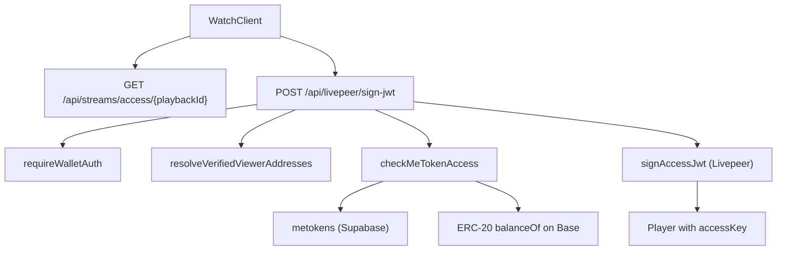

# Live stream MeToken gating

Creators can require viewers to hold a minimum balance of the creator's MeToken before watching **live** playback. Gating is enforced server-side via Livepeer access-control JWTs and on-chain ERC-20 balance checks on **Base**.

VOD / discover playback uses separate video-asset gating (`video_assets.requires_metoken`); this doc covers **live streams** only (`streams` table).

## Routes

| Path | Purpose |
|------|---------|
| `/watch/{playbackId}` | Live watch page; requests JWT and shows gate UI when blocked |
| `/live/{creatorAddress}` | Creator dashboard; `StreamMeTokenGateEditor` configures gate |

## Architecture



### Gate activation

A stream is gated when **both** are true (`isMeTokenGateActive` in `lib/utils/metoken-access.ts`):

- `streams.requires_metoken = true`
- `streams.metoken_price` is not null

If either is false, `sign-jwt` issues an anonymous JWT (1-hour TTL) without wallet auth.

### Access decision

`checkMeTokenAccess` (`lib/utils/metoken-access.ts`):

1. Resolves the creator's MeToken from `metokens` where `owner_address = creator_id`.
2. Reads `balanceOf` for each verified viewer address; uses the **maximum** balance across addresses.
3. Grants access when `maxBalance >= metoken_price` (wei-scale via `parseEther`).
4. **Creator bypass** (default): if any viewer address equals `creator_id`, access is allowed without balance check.

Deny reasons: `no_metoken`, `no_viewer_address`, `insufficient_balance`.

## Wallet authentication

Gated streams require cryptographic proof of address ownership before JWT issuance. The server does **not** trust a client-supplied address in the JSON body.

Headers (from `useWalletAuth` / `signWalletAuthHeaders`):

| Header | Purpose |
|--------|---------|
| `X-Wallet-Address` | Claimed address (EOA or smart account) |
| `X-Wallet-Timestamp` | Unix seconds; must be ≤ 5 minutes old |
| `X-Wallet-Signature` | Signature over canonical message |

Canonical message (`lib/auth/require-wallet.ts`):

```
Authorize Creative TV request for address {address} at {timestamp}
```

Verification uses EIP-1271 for smart accounts. See `lib/auth/require-wallet.ts`.

### Linked identity (EOA ↔ smart account)

Viewers often hold MeTokens on a different address than the one they sign with (EOA vs modular smart account). The client may send optional `companionAddress` in the `sign-jwt` body.

`resolveVerifiedViewerAddresses` (`lib/utils/linked-identity.ts`):

1. Always includes the cryptographically verified address from wallet auth.
2. Adds `companionAddress` only when `isLinkedWalletCompanion` proves EOA↔SMA ownership via CREATE2 prediction (`predictModularAccountV2Address`), not client trust alone.

Balance checks run against the union of verified + linked addresses.

## API routes

### `GET /api/streams/access/{playbackId}`

Public metadata for prefetching gate UI before JWT attempt. No wallet auth.

Response:

```json
{
  "requiresMetoken": true,
  "metokenPrice": "1",
  "meTokenSymbol": "CREATOR",
  "meTokenAddress": "0x…",
  "creatorAddress": "0x…",
  "streamName": "My Stream",
  "thumbnailUrl": "https://…"
}
```

Used by `WatchClient` to show gate copy early via `gatePrefetch`.

### `POST /api/livepeer/sign-jwt`

Signs Livepeer playback JWT. BotID + rate limiting enabled.

**Ungated stream** — body `{ "playbackId": "…" }` → `{ "token": "…" }`.

**Gated stream** — requires wallet auth headers. Body:

```json
{
  "playbackId": "…",
  "companionAddress": "0x…"
}
```

`companionAddress` is optional; only honored when linked to the verified signer.

**403 `METOKEN_REQUIRED`** responses include gate UI fields:

| Field | When |
|-------|------|
| `connectWallet: true` | No wallet auth headers |
| `signingRequired: true` | Wallet connected but signature missing/invalid/expired |
| `meTokenAddress`, `symbol`, `required`, `balance` | Insufficient balance |
| `creatorAddress` | For buy dialog |

## Creator setup

On `/live/{address}`, `StreamMeTokenGateEditor`:

1. Requires the creator to have a MeToken in Supabase (`useMeTokensSupabase`).
2. Toggle **Require MeToken for Access** → sets `requires_metoken`.
3. Set **Minimum MeToken Balance Required** → sets `metoken_price` (ETH-denominated display units; stored as `DECIMAL(20,8)`).
4. Persists via `updateStream(creatorAddress, …)` in `services/streams`.

Creators without a MeToken see a link to `/profile/{address}` to create one first.

## Database

Migration: `supabase/migrations/20260608120000_add_metoken_fields_to_streams.sql`

| Column | Type | Purpose |
|--------|------|---------|
| `requires_metoken` | `boolean` | Gate enabled (default `false`) |
| `metoken_price` | `decimal(20,8)` | Minimum balance; `null` when not required |

Indexed: `idx_streams_requires_metoken` (partial, `requires_metoken = true`).

## Client playback flow

`WatchClient` (`app/watch/[playbackId]/WatchClient.tsx`):

1. Prefetch gate metadata from `/api/streams/access/{playbackId}`.
2. When Livepeer sources exist, call `requestStreamJwt()`:
   - If gate likely active and no wallet → local gate state (`connectWallet`).
   - If wallet present → attach auth headers + optional `companionAddress`.
   - On 403 `METOKEN_REQUIRED` → `metoken-gated` status with `LiveStreamMeTokenGate`.
3. On wallet connect or after buy dialog closes → `retryAfterGate()`.
4. Successful JWT → `Player` receives `accessKey={jwt}`.

`LiveStreamMeTokenGate` shows connect → sign → buy flow based on gate fields.

## Environment

| Variable | Required for |
|----------|--------------|
| `ACCESS_CONTROL_PRIVATE_KEY` | Signing Livepeer JWTs |
| `NEXT_PUBLIC_ACCESS_CONTROL_PUBLIC_KEY` | Player access control |
| `NEXT_PUBLIC_ALCHEMY_API_KEY` | On-chain `balanceOf` reads |
| `SUPABASE_SERVICE_ROLE_KEY` | `metokens` lookup, stream rows |

## Security notes

- **Address spoofing**: Fixed in PR #178 — `sign-jwt` uses `requireWalletAuth` verified address only; body address is never trusted for access.
- **Companion spoofing**: `companionAddress` is ignored unless CREATE2-linked to the verified signer.
- **Rate limiting**: `rateLimiters.standard` on `sign-jwt`; BotID blocks automated abuse.

## Troubleshooting

### Gate UI shows but user holds enough MeTokens

- MeTokens may be on the companion address (EOA vs smart account). Ensure wallet is connected and signature approved so `companionAddress` is sent.
- Confirm balance is on the creator's MeToken (`metokens.address` for `owner_address = creator_id`), not a different token.
- Creator watching own stream should bypass via `creator_bypass`.

### "Approve Signature" loop

- Signature expired (> 5 min). Click **Approve Signature** to re-sign.
- Smart account EIP-1271 verification failed — check Base RPC / Alchemy key.

### JWT succeeds but playback still blocked

- JWT is playback-specific and expires in 1 hour. Check Livepeer access control keys match deployment.
- Verify `NEXT_PUBLIC_ACCESS_CONTROL_PUBLIC_KEY` is set in the client environment.

### Creator cannot enable gate

- Creator must have a MeToken row in Supabase. Create via profile MeToken flow first.
- `updateStream` must succeed (creator session / ownership check in streams service).

### Stream not gated but expected to be

- Gate requires **both** `requires_metoken = true` and non-null `metoken_price`.
- `isMeTokenGateActive` is used consistently on server and client.

## Related docs

- [Platform API](./platform-api.md) — `requiresMetoken` on VOD playback resolver
- [MeTokens setup](../METOKENS_SETUP.md) — MeToken creation and subgraph
- [Smart account auth](../SMART_ACCOUNT_AUTH.md) — Account Kit architecture
