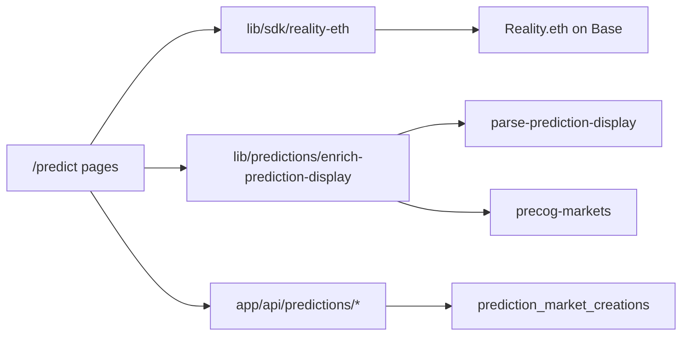

# Predictions (Reality.eth)

Creative TV prediction markets on **Base** using [Reality.eth](https://reality.eth.limo/). Users browse public markets, create questions, bond answers, and claim winnings. On-chain state lives in Reality.eth; Supabase stores creation metadata for quotas, search, and display fallbacks.

## Routes

| Path | Purpose |
|------|---------|
| `/predict` | Market list with category filters and search |
| `/predict/[questionId]` | Market detail, betting, claim UI, OG metadata |
| `/predict/create` | Create form (gated by membership rules) |

Public fan access: list and detail pages do not require wallet connection. Creating and betting require a connected smart account.

## Architecture



### Display enrichment pipeline

1. **`parsePredictionDisplay`** — Decodes on-chain `question` text using Reality.eth template ID when available, otherwise splits on the unit separator (`␟` / `\u241F`).
2. **`applyPredictionMetadataOverride`** — Fills gaps from Supabase when on-chain parse fails (bad title, missing outcomes).
3. **`enrichPredictionDisplaySync`** — Merges subgraph outcomes/category, strips Precog references from titles.
4. **`enrichPredictionDisplay`** — Async variant; fetches Precog market data when title ends with `[core.precog.markets/{chainId}/{marketId}]`.
5. **`answerBytesToLabel`** — Maps `bytes32` final answers to human labels (bool, uint, keccak-hashed select options).

Key files:

- `lib/predictions/parse-prediction-display.ts`
- `lib/predictions/enrich-prediction-display.ts`
- `lib/predictions/precog-markets.ts`
- `lib/predictions/claim-status.ts`

### Question types

| Type | Template source | Outcomes required |
|------|-----------------|-------------------|
| `bool` | `@reality.eth/reality-eth-lib` | No (defaults Yes/No) |
| `uint` | same | No |
| `single-select` | same | Yes (≥ 2) |
| `multiple-select` | same | Yes (≥ 2) |

Template IDs are resolved via `getTemplateIdForQuestionType` in `lib/predictions/reality-template.ts`.

### Categories

Defined in `lib/predictions/categories.ts`: `creative tv`, `songchain`, `general`, `technology`, `sports`, `entertainment`. Songchain markets get special UX (`isSongchainCategory`).

## Access control

`usePredictionAccess` (`lib/hooks/predictions/usePredictionAccess.ts`):

| Actor | Create / bet |
|-------|--------------|
| Platform admin | Allowed |
| Investor or Brand pass (`BASE_CREATIVE_PASS`, `BASE_CREATIVE_PASS_3`) | Allowed, unlimited monthly quota |
| Creator tier (`BASE_CREATIVE_PASS_2`) | **Blocked** — keeps markets fan-facing |
| Other connected wallets | Allowed, subject to monthly quota |

Creator block message: *"Creator members can't create or bet on predictions — this keeps markets fair for fans."*

## Monthly creation quota

Non-premium wallets: **3 markets per UTC calendar month** (`PREDICTION_MARKETS_MONTHLY_LIMIT`).

Flow after on-chain `createQuestion`:

1. Client calls `GET /api/predictions/quota?address=0x…` before submit.
2. After tx confirms, client calls `POST /api/predictions/record` with tx hash + metadata.
3. Server inserts into `prediction_market_creations` (skipped for unlimited/admin).

Premium unlimited tiers are checked via Unlock Protocol memberships in `lib/predictions/prediction-quota.ts`.

## API routes

All routes use BotID verification and generous rate limiting.

### `GET /api/predictions/quota?address=0x…`

Returns `{ unlimited, premiumTier, usedThisMonth, monthlyLimit, remaining }`.

### `POST /api/predictions/record`

Body (JSON):

```json
{
  "address": "0x…",
  "transactionHash": "0x…",
  "questionId": "0x…",
  "title": "Will …?",
  "category": "general",
  "questionType": "bool",
  "outcomes": ["Yes", "No"]
}
```

Responses:

- `{ recorded: true }` — counted against quota
- `{ recorded: false, unlimited: true }` — premium/admin, no insert
- `403` + `PREDICTION_QUOTA_EXCEEDED` or `CREATOR_TIER_BLOCKED`

### `GET /api/predictions/metadata?questionId=0x…`

Returns stored title/category/questionType/outcomes for display override. `{ metadata: null }` if not found.

### `GET /api/predictions/claim-status?questionId=0x…&address=0x…&smartAccount=0x…`

Server-side claim eligibility check. Status values:

| Status | Meaning |
|--------|---------|
| `not_participant` | No bonded answers or question not finalized |
| `bonded_lost` | User bonded on a losing answer |
| `won_pending_claim` | Winning bonds exist, balance not yet withdrawable |
| `won_withdrawable` | ETH balance available to withdraw |
| `already_settled` | (reserved; client handles post-withdraw) |

### `GET /api/predictions/precog?chainId=8453&marketId=18`

Proxies Precog market fetch with in-memory cache (5 min TTL). Used when question titles reference Precog markets.

### `GET /api/search/predictions?q=…&limit=8`

Autocomplete over `prediction_market_creations` via `autocomplete_prediction_creations` RPC. Minimum query length: 2 characters.

## Supabase: `prediction_market_creations`

| Column | Purpose |
|--------|---------|
| `creator_address` | Lowercase `0x` address |
| `transaction_hash` | Unique per creation |
| `question_id` | Set after on-chain question ID known |
| `title`, `category`, `question_type` | Search + display |
| `outcomes` | `jsonb` array of outcome labels |
| `created_at` | UTC month boundary for quota |

Migrations: `20260505120000_create_prediction_market_creations.sql`, `20260605120000_prediction_search_indexes.sql`, `20260606120000_prediction_outcomes_column.sql`.

Writes use **service role** only (`app/api/predictions/record`). Public read policy enables autocomplete.

## Claim winnings

`ClaimWinningsCard` uses `getUserClaimStatus` then on-chain `claimWinnings` + `withdraw` from `lib/sdk/reality-eth/reality-eth-question-wrapper`. Checks both EOA and smart account addresses.

## Precog market references

Question titles may suffix:

```
[core.precog.markets/8453/18]
```

`parsePrecogReference` extracts chain/market IDs; `fetchPrecogMarket` tries:

- `https://core.precog.markets/api/markets/{chainId}/{marketId}`
- `https://core.precog.markets/api/v1/markets/{chainId}/{marketId}`

## Environment

| Variable | Required for |
|----------|--------------|
| `NEXT_PUBLIC_ALCHEMY_API_KEY` | Base RPC (read questions, claim status) |
| Supabase service role (via `supabaseService`) | Quota, record, metadata, search |

Reality.eth contract on Base: see `REALITY_ETH_SUBGRAPH_CONFIG.md` (`0x2F39f464d16402Ca3D8527dA89617b73DE2F60e8`).

## Troubleshooting

### Title shows `[Badly formatted question]` or `Untitled Prediction`

On-chain text failed template parse. Ensure `POST /api/predictions/record` included `title`, `questionType`, and `outcomes`. Detail page fetches metadata via `/api/predictions/metadata`.

### Select answer shows hex instead of label

Check `questionType` and `outcomes` in metadata. `answerBytesToLabel` hashes outcome strings with keccak256 for select types; uint answers use numeric or 0/1-based index mapping.

### Quota says limit reached but user has Investor/Brand pass

Verify Unlock membership is valid on Base. Pass addresses: `BASE_CREATIVE_PASS` (Brand), `BASE_CREATIVE_PASS_3` (Investor) in `lib/sdk/unlock/services`.

### Search returns no results

Requires Supabase `pg_trgm` extension and `autocomplete_prediction_creations` RPC (migration `20260605120000`). Markets created outside Creative TV are not indexed unless recorded manually.

### Creator cannot create despite being connected

Expected for Creator tier (`BASE_CREATIVE_PASS_2`). Only Investor, Brand, admin, or non-member wallets may create/bet.

### Precog title not enriching

Confirm reference format at end of title. Check `/api/predictions/precog` returns outcomes. External API may be down — UI falls back to stripped title.

## Related docs

- [Reality.eth subgraph config](../REALITY_ETH_SUBGRAPH_CONFIG.md) — contract address, start block, ABI
- [Reality.eth subgraph hosting](../REALITY_ETH_SUBGRAPH_HOSTING.md) — indexing deployed markets
